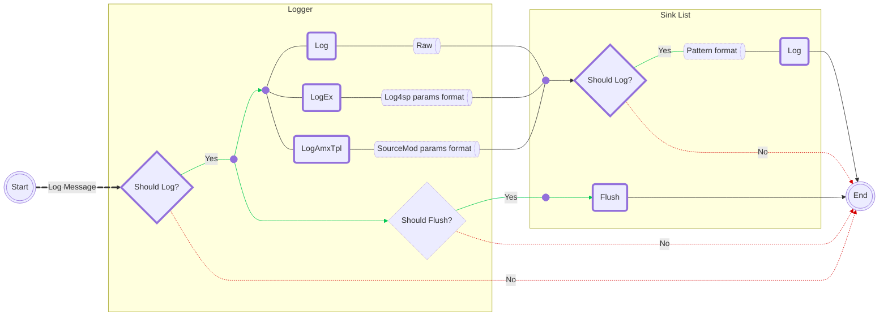

# Log4sp

一个基于 [spdlog](https://github.com/gabime/spdlog) 的 SourceMod 高性能日志框架拓展

## 特点

1. 非常快，比 [SourceMod API - Logging](https://sm.alliedmods.net/new-api/logging) 快得多
2. 支持日志过滤 - 可以在编译时与运行时修改 [日志级别](#日志级别)
3. 支持超大日志 - 超过 2048 个字符也不会被[截断](#参数格式化)
4. 支持自定义[日志样式](#模板格式化)
5. 支持日志操作[无异常中断](#错误处理器)
6. 内置多种[输出源](./sourcemod/scripting/include/log4sp/sinks)
7. 内置控制台指令以及管理菜单
8. 支持 x64

## 安装

1. 从 [Releases](https://github.com/F1F88/sm-ext-log4sp/releases) 中下载合适的版本
    - `sm-ext-log4sp` 包含 extension 文件和 scripting 头文件
    - `sm-plugin-log4sp_manager` 插件支持用户指令与菜单管理 logger（依赖于 extension）
2. 将 "addons/sourcemod" 目录中的文件上传到服务器

## 使用

Natives 文档：[./sourcemod/scripting/include/log4sp/](./sourcemod/scripting/include/log4sp)

**Basic file logger**

```sourcepawn
#include <sourcemod>
#include <log4sp>

public void OnPluginStart()
{
    char path[PLATFORM_MAX_PATH];
    BuildPath(Path_SM, path, sizeof(path), "logs/simple-file.log");

    Logger logger = BasicFileSink.CreateLogger("my-logger", path);
    logger.Info("Hello World!");

    delete logger;
}
```

**Daily files logger** (基于日期旋转)

```sourcepawn
#include <sourcemod>
#include <log4sp>

public void OnPluginStart()
{
    char path[PLATFORM_MAX_PATH];
    BuildPath(Path_SM, path, sizeof(path), "logs/daily-file.log");

    Logger logger = DailyFileSink.CreateLogger("my-logger", path);
    logger.Info("Hello Log4sp!");

    delete logger;
}
```

**Rotating files logger** (基于文件大小旋转)

```sourcepawn
#include <sourcemod>
#include <log4sp>

public void OnPluginStart()
{
    char path[PLATFORM_MAX_PATH];
    BuildPath(Path_SM, path, sizeof(path), "logs/rotate-file.log");

    const int maxFileSize = 1024 * 10;
    const int maxFiles = 3;

    Logger logger = RotatingFileSink.CreateLogger("my-logger", path, maxFileSize, maxFiles);
    logger.Info("Hello everyone!");

    delete logger;
}
```

### 日志级别

Log4sp 定义了 **`7`** 个日志级别，从低往高依次为：**`trace`**、**`debug`**、**`info`**、**`warn`**、**`error`**、**`fatal`**、**`off`**

仅当日志消息级别 **≥** Logger 的日志级别时，才会格式化日志消息并传递到 Sinks；

仅当日志消息级别 **≥** Sink 的日志级别时，才会记录日志消息到此 sink。

**Logger** 的默认日志级别为 `info`；

**Sink** 的默认日志级别为 `trace`。

```sourcepawn
logger.SetLevel(LogLevel_Warn);     // 修改 Logger 的日志级别为 warn
logger.ShouldLog(LogLevel_Warn);    // true

sink.SetLevel(LogLevel_Debug);      // 修改 Sink 的日志级别为 debug
sink.ShouldLog(LogLevel_Trace);     // false
```

### 参数格式化

以 [**Logger::Log**](./sourcemod/scripting/include/log4sp/logger.inc#L163) 为例，普通 Log 方法只会按原样输出日志消息，而 LogEx、LogAmxTpl 则先参数格式化，再输出格式化的日志消息。

参数格式化在 **Logger** 层执行，仅当日志消息级别 **≥** logger 日志级别时才会触发。

|                                                              | Log  |                            LogEx                             |                          LogAmxTpl                           |                       SM - LogMessage                        |
| :----------------------------------------------------------: | :--: | :----------------------------------------------------------: | :----------------------------------------------------------: | :----------------------------------------------------------: |
|                         **运行效率**                         | 最快 |                             较快                             |                             较快                             |                             较慢                             |
|                         **最多字符**                         | 无限 |                             无限                             |                             2048                             |                             2048                             |
|                        **参数格式化**                        |  ×   |                              √                               |                              √                               |                              √                               |
|                           **实现**                           |  ×   |          [Log4sp Format](./src/log4sp/common.h#L95)          | [SourceMod Format](https://github.com/alliedmodders/sourcemod/blob/master/core/logic/sprintf.h#L40) | [SourceMod Format](https://github.com/alliedmodders/sourcemod/blob/master/core/logic/sprintf.h#L40) |
|                           **用法**                           |  ×   | 与 [Format wiki](https://wiki.alliedmods.net/Format_Class_Functions_(SourceMod_Scripting)) 一致 | 与 [Format wiki](https://wiki.alliedmods.net/Format_Class_Functions_(SourceMod_Scripting)) 一致 | 与 [Format wiki](https://wiki.alliedmods.net/Format_Class_Functions_(SourceMod_Scripting)) 一致 |
|                         **格式错误**                         |  ×   |                      移交 Error Handler                      |                           抛出错误                           |                           抛出错误                           |
|                        **通配符 %s**                         |  ×   |                  默认右对齐<br/>支持左对齐                   |                 默认左对齐<br/>不支持右对齐                  |                 默认左对齐<br/>不支持右对齐                  |
| **溢出 [BUG](https://github.com/alliedmodders/sourcemod/issues/2221)** |  ×   |                        修复于 v1.5.0                         | 修复于 [1.13.0.7198](https://github.com/alliedmodders/sourcemod/pull/2255) | 修复于 [1.13.0.7198](https://github.com/alliedmodders/sourcemod/pull/2255) |
|                         **符号 BUG**                         |  ×   |                        修复于 v1.8.0                         |            **"%0[width]d"**<br> "-1" --> "000-1"             |            **"%0[width]d"**<br/> "-1" --> "000-1"            |

### 模板格式化

日志模板是定义日志消息样式的一种机制，支持自定义日志的输出样式（如附加logger 名称、日志时间、日志级别等）

模板格式化发生在 **Sink** 层，Sink 先模板格式化，再输出格式化的日志消息。

Sink 的默认模板与输出样例如下：

```
[%Y-%m-%d %H:%M:%S.%e] [%n] [%l] [%s:%#] %v
```

```
[2024-08-01 12:34:56:789] [log4sp] [info] [example.sp:123] Hello World!
```

您可以参考如下代码修改模板：

```sourcepawn
sink.SetPattern("[%Y-%m-%d %H:%M:%S] [%n] [%l] %v 1")       // 修改单个 sink 的模板
logger.SetPattern("[%Y-%m-%d %H:%M:%S] [%n] [%l] %v 2");    // 修改全部 sinks 的模板
```

完整通配符文档： [\<spdlog wiki> - Custom-formatting](https://github.com/gabime/spdlog/wiki/Custom-formatting#pattern-flags)

### 刷写策略

Log4sp 让底层 libc 在[认为合适时](https://github.com/gabime/spdlog/wiki/Flush-policy)刷写缓冲区，以实现良好的性能。

您可以通过以下方式覆盖这一点：

1. 手动刷写

    ```sourcepawn
    sink.Flush();   // 刷写单个 sink 的缓冲区
    logger.Flush(); // 刷写所有 sinks 的缓冲区
    ```

2. 刷写级别

    Logger 的默认自动刷写级别为 `LogLevel_Off`。

    ```sourcepawn
    logger.FlushOn(LogLevel_Warn);  // 当日志消息级别 ≥ "Warn" 时，立即刷写缓冲区
    ```

3. 定期刷写

    ```sourcepawn
    public void OnPluginStart()
    {
        CreateTimer(5.0, Timer_FlushAll, _, TIMER_REPEAT);
    }

    Action Timer_FlushAll(Handle timer)
    {
        Logger.ApplyAll(Timer_FlushAll);
        return Plugin_Continue;
    }

    void Timer_FlushAll(Logger logger)
    {
        logger.Flush();
    }
    ```

### 错误处理器

通常，Log4sp 的 Natives 只会在参数无效时抛出错误并中断代码的执行；对于拓展内部的错误（记录日志、刷写等），则交给 Error Handler 处理，且不会中断代码的执行。

默认情况下，Error Handler 会将错误信息记录到 SourceMod 的 errors.log 文件。

```sourcepawn
void SetMyErrorHandler(Logger logger)
{
    logger.SetErrorHandler(LogToSourceMod);
}

void LogToSourceMod(const char[] msg, const char[] name, const char[] file, int line, const char[] func)
{
    LogError("[%s::%d] [%s] %s", file, line, name, msg);
}
```

**注意:** 参数格式化的错误可以直接抛出，也可以交给 Error Handler 处理，这取决于是由 Log4sp（LogEx）还是由 SourceMod （LogAmxTpl）处理的格式化。

### 全局记录器

全局 logger 名为 "**`log4sp`**"，由拓展在加载时创建，其生命周期与拓展相同，且不会被任何插件释放。

全局 logger 初始时仅有一个 ServerConsoleSink  类型的输出源，其余属性均为默认值。

```sourcepawn
Logger GetGlobalLogger()
{
    Logger logger = Logger.Get(LOG4SP_GLOBAL_LOGGER_NAME);

    static bool added = false;
    if (!added)
    {
        AddDailyFileSink(logger);
        added = true;
    }

    logger.Info("Hello log4sp");
    return logger;
}

void AddDailyFileSink(Logger logger)
{
    char path[PLATFORM_MAX_PATH];
    BuildPath(Path_SM, path, sizeof(path), "logs/global-logger.log");

    DailyFileSink sink = new DailyFileSink(path);

    logger.AddSink(sink);
    delete sink;
}
```

### 多个输出源

```sourcepawn
Logger CreateMultiSinksLogger()
{
    char file[PLATFORM_MAX_PATH];
    BuildPath(Path_SM, file, sizeof(file), "logs/log4sp-multi-sinks.log");

    Sink sinks[3];
    sinks[0] = new DailyFileSink(file);
    sinks[1] = new ServerConsoleSink();
    sinks[2] = new ClientChatSink();

    Logger logger = Logger.CreateLoggerWith("multi-sink-logger", sinks, 3);

    delete sinks[0];
    delete sinks[1];
    delete sinks[2];

    logger.Info("Successfully created logger with multiple sinks");
    return logger;
}
```

### 生命周期

底层 Logger 对象和 Sink 对象只有在引用计数为 0 时才会从内存中删除。

在 [多个输出源](#多个输出源) 章节中，代码 13-15 行关闭了 sink handle，但底层 Sink 对象不会被删除，因为 11 行创建的 logger 引用了这些 Sinks 对象。

- 执行 11 行前，Sinks 对象只有 Handles 系统引用，因此 Sinks 的引用数为 1；

- 执行 11 行后，logger 引用了 Sinks 对象，因此 Sinks 的引用数增加为 2；

- 执行 13-15 行后，Handles 系统移除引用 Sinks 对象，因此 Sinks 引用数减少为 1；

- 关闭 logger handle 后，将自动移除对 Sinks 对象的引用，因此 Sinks 引用数减少为 0 并从内存中删除。


| **Handle 类型** |         Logger         | Sink |
| :-------------: | :--------------------: | :--: |
|   **可关闭**    | 是（全局 Logger 除外） |  是  |
|   **可克隆**    |           是           |  是  |

## 架构流程



## 性能测试

测试平台: Windows 11 + VMware + Ubuntu 24.04 LTS + SourceMod 1.13.0.7178

主机配置: AMD Ryzen 7 7840HS + 32 GB 内存

VM Ubuntu 配置: 1 CPU + 8 核心 + 8 GB 内存

测试用例：[./sourcemod/scripting/testsuit/benchmark-log4sp-ext.sp](./sourcemod/scripting/testsuite/benchmark-log4sp-ext.sp)

```
[benchmark] base-file         | Iters 1000000 | Elapsed  0.385 secs   2592735/sec
[benchmark] daily-file        | Iters 1000000 | Elapsed  0.393 secs   2541238/sec
[benchmark] rotating-file     | Iters 1000000 | Elapsed  0.406 secs   2462884/sec
[benchmark] server-console    | Iters 1000000 | Elapsed  5.224 secs    191411/sec
```

作为参考, 还测试了 sourcemod 的 [logging API](https://sm.alliedmods.net/new-api/logging)

测试用例：[./sourcemod/scripting/testsuit/benchmark-sm-logging.sp](./sourcemod/scripting/testsuite/benchmark-sm-logging.sp)

```
[benchmark] LogMessage    | Iters 1000000 | Elapsed  8.862 secs    112829/sec
[benchmark] LogToFile     | Iters 1000000 | Elapsed  7.392 secs    135267/sec
[benchmark] LogToFileEx   | Iters 1000000 | Elapsed  7.284 secs    137272/sec
[benchmark] PrintToServer | Iters 1000000 | Elapsed  5.419 secs    184534/sec
```
## 编译构建

### Linux

1. 下载依赖与项目文件

    ```bash
    mkdir alliedmodders && cd alliedmodders
    git clone https://github.com/alliedmodders/ambuild
    git clone --recursive https://github.com/alliedmodders/sourcemod -b 1.12-dev
    git clone https://gitclone.com/github.com/F1F88/sm-ext-log4sp.git
    ```

2. 安装 Ambuild

    ```bash
    pip install ./ambuild
    ```

3. 编译构建

    ```bash
    mkdir sm-ext-log4sp/build && cd sm-ext-log4sp/build
    python3 ../configure.py --enable-optimize --sm-path ../../sourcemod --targets=x86,x64
    ambuild
    ```

### Windows

1. 安装 Visual Studio、Python、Git（参考 [Building SourceMod](https://wiki.alliedmods.net/Building_sourcemod#Windows)）

2. 下载依赖与项目文件

    ```cmd
    mkdir alliedmodders && cd alliedmodders
    git clone https://github.com/alliedmodders/ambuild
    git clone --recursive https://github.com/alliedmodders/sourcemod -b 1.12-dev
    git clone https://gitclone.com/github.com/F1F88/sm-ext-log4sp.git
    ```

3. 安装 AMBuild

    ```cmd
    pip install ./ambuild
    ```

4. 编译构建（在 Developer Command Prompt 环境中）

    ```cmd
    mkdir sm-ext-log4sp/build && cd sm-ext-log4sp/build
    python3 ../configure.py --enable-optimize --sm-path ../../sourcemod --targets=x86
    ambuild
    ```

## 常见问题

### AMBuild

error: externally-managed-environment

```shell
# ref: https://blog.csdn.net/2202_75762088/article/details/134625775
# Ubantu 默认没有安装 pip
sudo apt install python3-pip
# 下行代码需要将 python3.x 修改为你的版本
sudo mv /usr/lib/python3.x/EXTERNALLY-MANAGED /usr/lib/python3.x/EXTERNALLY-MANAGED.bk
# 再次尝试安装 AMBuild
pip install ./ambuild
```

### Extension

#### 编译问题

Linux 环境切换 clang/gcc 编译器

```shell
export CC=clang
export CXX=clang
```

Unable to find a suitable CXX compiler

```shell
# ref: https://blog.csdn.net/weixin_38939826/article/details/105174347
sudo yum install gcc-c++ libstdc++-devel
```

gnu/stubs-32.h: No such file or directory

```shell
# ref: https://blog.csdn.net/wang_xijue/article/details/47128423
sudo yum install glibc-devel.i686
```

bits/c++config.h: No such file or directory

```shell
# ref: https://blog.csdn.net/Edidaughter/article/details/122627186
sudo apt-get install gcc-multilib g++-multilib
```

/usr/bin/ld: cannot find -lstdc++

> 删除 **`AMBuildScript`** 中的 [cxx.linkflags += \['-static-libstdc++']](./AMBuildScript#L314)

#### 运行问题

[SM] Unable to load extension "log4sp.ext": Could not find interface

> 检查 `extension` 版本是否与操作系统匹配
>
> 检查 `extension` 版本是否与 SourceMod 版本是否匹配

bin/libstdc++.so.6: version 'GLIBCXX_3.4.20' not found

> 详细方案请参考：[#6](https://github.com/F1F88/sm-ext-log4sp/issues/6)

### Plugins

#### 编译问题

error 139: could not find type "Logger"

> 检查是否缺少 `#include <log4sp>` 引入依赖
>
> 检查编译环境中是否缺少 Log4sp includes 文件
>
> 检查 Log4sp includes 文件版本是否过时

#### 运行问题

[SM] Unable to load plugin "....smx": Required extension "Log4sp" file("log4sp.ext") not running

> 检查 `"addons/sourcemod/extensions"` 文件夹内是否缺少 `log4sp.ext` 拓展文件

执行 logger.Log(...) 后，日志文件没有数据

> 详细解答请参考：[\<spdlog wiki> FAQ](https://github.com/gabime/spdlog/wiki/FAQ#the-log-file-remains-empty)

## 特别感谢

- **[gabime](https://github.com/gabime)** 的 **[spdlog](https://github.com/gabime/spdlog)** 项目实现了大部分功能，Log4sp 将其包装到 SourceMod Natives
- Fyren, nosoop, Deathreus 为拓展管理 Sink Handle 提供了解决思路
- [blueblur0730](https://github.com/blueblur0730), Digby 帮助改进了遍历操作所有 logger
- Bakugo, Anonymous Player, Fyren 帮助解决异步调用 SourcePawn 导致崩溃的问题
- [blueblur0730](https://github.com/blueblur0730) 添加了 log4sp_manager 插件

如有遗漏，请联系我
