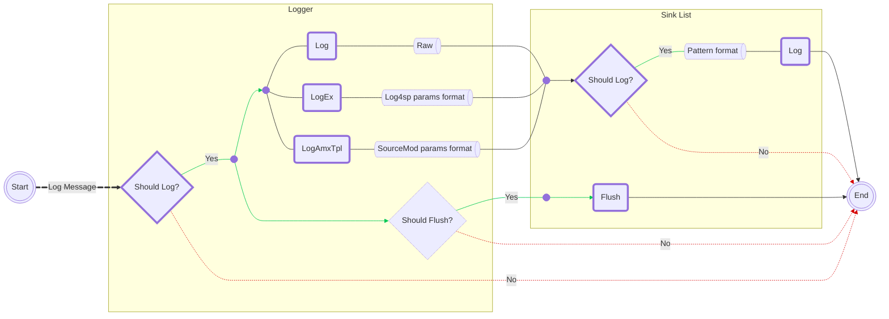

**[English](./readme.md) | [中文](./readme-chi.md)**

# Log4sp

Log4sp 是基于 [spdlog](https://github.com/gabime/spdlog) 构建的高性能日志库，旨在帮助开发者高效地记录、格式化和管理应用程序日志。Log4sp 充分利用了 spdlog 的卓越性能与灵活性，为 SourceMod 提供了一个更易于集成的日志接口，能够满足从轻量级插件到大型高性能项目的日志记录需求。

借助 log4sp，开发者可以轻松跟踪插件运行状态、定位问题并监控性能，同时利用高性能日志库降低日志记录对插件运行效率的影响。

## 特点

1. 非常快，比 [SourceMod API - Logging](https://sm.alliedmods.net/new-api/logging) 快得多
2. 支持日志过滤 - 可以在编译时与运行时修改 [日志级别](#日志级别)
3. 支持超大日志 - 超过 [1024](https://github.com/alliedmodders/sourcemod/blob/be89b25d96486900a57e07661f992836479f4fc4/core/logic/smn_filesystem.cpp#L936-L970) 个字符也不会被[截断](#参数格式化)
4. 支持自定义[日志样式](#模板格式化)
5. 支持日志操作[无错误中断](#错误处理器)
6. 支持多种[输出源](./sourcemod/scripting/include/log4sp/sinks)
7. 支持控制台指令以及管理菜单
8. 支持 int64
9. 支持 x64

## 安装

1. 从 [Releases](https://github.com/F1F88/sm-ext-log4sp/releases) 中下载合适的版本
    - `sm-ext-log4sp` 包含扩展库以及日志操作相关 API 的头文件
    - `sm-plugin-log4sp_manager` 包含管理插件以及管理记录器相关 API 的头文件
2. 把压缩包中的文件复制到服务器的 "addons/sourcemod" 目录下

## 使用

Natives 文档：[./sourcemod/scripting/include/log4sp/](./sourcemod/scripting/include/log4sp)

**Hello World**

```sourcepawn
#include <sourcemod>
#include <log4sp>

public void OnPluginStart()
{
    ServerConsoleSink sink = new ServerConsoleSink();
    Logger logger = new Logger("my-logger");
    logger.AddSink(sink);

    logger.Info("Hello World!");

    sink.Close();
    logger.Close();
}
```

服务器控制台输出：

> [2001-02-03 12:34:56.789] [my-logger] [info] Hello World!<br>

### 日志级别

Log4sp 定义了 **`7`** 个日志级别，从低往高依次为：**`trace`** < **`debug`** < **`info`** < **`warn`** < **`error`** < **`fatal`** < **`off`**。

仅当日志消息级别 **≥** Logger 的日志级别时，才会格式化日志消息并传递到 Sinks；

仅当日志消息级别 **≥** Sink 的日志级别时，才会记录日志消息到此 sink。

开发者可以根据日志级别筛选日志，确保仅记录相关日志消息，从而提高调试效率并保持日志文件的整洁有序。

**Logger** 的默认日志级别为 `info`；

**Sink** 的默认日志级别为 `trace`。

```sourcepawn
logger.SetLevel(LogLevel_Warn);     // 修改 Logger 的日志级别为 warn
logger.ShouldLog(LogLevel_Warn);    // true

sink.SetLevel(LogLevel_Debug);      // 修改 Sink 的日志级别为 debug
sink.ShouldLog(LogLevel_Trace);     // false
```

```sourcepawn
#include <sourcemod>
#include <log4sp>

public void OnPluginStart()
{
    char path[PLATFORM_MAX_PATH];
    BuildPath(Path_SM, path, sizeof(path), "logs/simple-file.log");
    BasicFileSink sink = new BasicFileSink(path);

    Logger logger = new Logger("my-logger");
    logger.AddSink(sink);
    logger.SetLevel(LogLevel_Warn);

    logger.Debug("Test ...");
    logger.Info("Information ...");
    logger.Warn("Warning ...");
    logger.Error("Oops ...");

    sink.Close();
    logger.Close();
}
```

文件 `game/addons/sourcemod/logs/simple-file.log`：

> [2001-02-03 12:34:56.789] [my-logger] [warn] Warning ...<br>
> [2001-02-03 12:34:56.789] [my-logger] [error] Oops ...<br>

### 参数格式化

以 [**Logger::Log**](./sourcemod/scripting/include/log4sp/logger.inc#L165) 为例，普通 `Log` 方法只会按原样输出日志消息，而 `LogEx` / `LogAmxTpl` 则先将参数格式化，再输出格式化后的日志消息。

参数格式化在 **Logger** 层执行，且仅当日志消息级别 **≥** logger 日志级别时才会触发。

|                                                              |  Log   |                            LogEx                             |                          LogAmxTpl                           |                       SM - LogMessage                        |
| :----------------------------------------------------------- | :----: | :----------------------------------------------------------: | :----------------------------------------------------------: | :----------------------------------------------------------: |
| **运行效率**                                                 |  最快  |                             较快                             |                             较快                             |                             较慢                             |
| **最多字符数**                                               | 无限制 |                            无限制                            |                             2048                             |                             1024                             |
| **参数格式化**                                               |   ×    |                              √                               |                              √                               |                              √                               |
| **实现**                                                     |   ×    |            [Log4sp Format](./src/log4sp/format.h)            | [SM Format](https://github.com/alliedmodders/sourcemod/blob/master/core/logic/sprintf.h#L40) | [SM Format](https://github.com/alliedmodders/sourcemod/blob/master/core/logic/sprintf.h#L40) |
| **用法**                                                     |   ×    | [Format wiki](https://wiki.alliedmods.net/Format_Class_Functions_(SourceMod_Scripting)) | [Format wiki](https://wiki.alliedmods.net/Format_Class_Functions_(SourceMod_Scripting)) | [Format wiki](https://wiki.alliedmods.net/Format_Class_Functions_(SourceMod_Scripting)) |
| **格式错误**                                                 |   ×    |                      调用 Error Handler                      |                           抛出错误                           |                           抛出错误                           |
| **填充 [BUG](https://github.com/alliedmodders/sourcemod/issues/2221)** |   ×    |                        修复于 v1.5.0                         |                        修复于 v1.5.0                         | 修复于 [1.13.0.7198](https://github.com/alliedmodders/sourcemod/pull/2255) |
| **浮点 [Inf](https://github.com/alliedmodders/sourcemod/issues/2110)** |   ×    |                        修复于 v1.10.0                        |                        修复于 v1.10.0                        | 新增于 [1.13.0.7269](https://github.com/alliedmodders/sourcemod/pull/2324) |
| **减号 [BUG](https://github.com/alliedmodders/sourcemod/issues/2328)** |   ×    |                        修复于 v1.8.0                         |                        修复于 v1.8.0                         | 修复于 [1.13.0.7270](https://github.com/alliedmodders/sourcemod/pull/2329) |
| **对齐 [BUG](https://github.com/alliedmodders/sourcemod/issues/2331)** |   ×    |                        修复于 v1.5.0                         |                        修复于 v1.5.0                         | 修复于 [1.13.0.7271](https://github.com/alliedmodders/sourcemod/pull/2332) |
| **通配符 [%E](https://github.com/alliedmodders/sourcemod/issues/2099)** |   ×    |                        新增于 v1.10.0                        |                        新增于 v1.10.0                        | 新增于 [1.13.0.7276](https://github.com/alliedmodders/sourcemod/pull/2330) |
| **通配符 [%ld, %li, %lu](https://github.com/alliedmodders/sourcemod/issues/2413)** |   ×    |                        新增于 v1.11.0                        |                        新增于 v1.11.0                        | 新增于 [1.13.0.7326](https://github.com/alliedmodders/sourcemod/pull/2421) |
| **浮点数 [-Inf](https://github.com/alliedmodders/sourcemod/issues/2444)** |   ×    |                        新增于 v1.11.0                        |                        新增于 v1.11.0                        | 新增于 [1.13.0.7330](https://github.com/alliedmodders/sourcemod/pull/2444) |
| **填充 [BUG](https://github.com/alliedmodders/sourcemod/pull/2443)** |   ×    |                        修复于 v1.8.0                         |                        修复于 v1.8.0                         | 修复于 [1.13.0.7331](https://github.com/alliedmodders/sourcemod/pull/2443) |
| **通配符 [%lb, %lX, %lx](https://github.com/alliedmodders/sourcemod/pull/2448)** |   ×    |                        新增于 v1.11.0                        |                        新增于 v1.11.0                        | 新增于 [1.13.0.7342](https://github.com/alliedmodders/sourcemod/pull/2448) |

```sourcepawn
#include <sourcemod>
#include <log4sp>

public void OnPluginStart()
{
    LoadTranslations("common.phrases");

    char path[PLATFORM_MAX_PATH];
    BuildPath(Path_SM, path, sizeof(path), "logs/daily-file.log");
    DailyFileSink sink = new DailyFileSink(path);

    Logger logger = new Logger("my-logger");
    logger.AddSink(sink);

    logger.InfoEx("d: %d, u: %u, b: %b", 1, 2, 3);
    logger.WarnEx("f: %f, x: %x, X: %X", 4.0, 5, 6);
    logger.ErrorEx("s: %s, c: %c, T: %T", "Some String", '!', "Yes", LANG_SERVER);

    sink.Close();
    logger.Close();
}
```

文件 `game/addons/sourcemod/logs/daily-file_20010203.log`：

> [2001-02-03 12:34:56.789] [my-logger] [info] d: 1, u: 2, b: 11<br>
> [2001-02-03 12:34:56.789] [my-logger] [warn] f: 4.000000, x: 5, X: 6<br>
> [2001-02-03 12:34:56.789] [my-logger] [error] s: Some String, c: !, T: Yes<br>

### 模板格式化

日志模板是一种格式化日志消息的配置机制，允许通过时间戳、严重级别、记录器名称等元数据字段，自定义日志的呈现样式。

模板格式化在 **Sink** 层完成，该层先对模板进行解析和渲染，再将格式化后的日志消息输出。

Sink 的默认模板与输出样例如下：

```
[%Y-%m-%d %H:%M:%S.%e] [%n] [%l] [%s:%#] %v
```

```
[2001-02-03 12:34:56.789] [my-logger] [info] [example.sp:123] Hello World!
```

您可以参考如下代码修改模板：

```sourcepawn
sink.SetPattern("[%Y-%m-%d %H:%M:%S] [%n] [%l] %v 1");   // 修改单个 sink 的模板
logger.SetPattern("[%Y-%m-%d %H:%M:%S] [%n] [%l] %v 2"); // 修改全部 sinks 的模板
```

完整通配符文档： [\<spdlog wiki> - Custom-formatting](https://github.com/gabime/spdlog/wiki/Custom-formatting#pattern-flags)

```sourcepawn
#include <sourcemod>
#include <log4sp>

public void OnPluginStart()
{
    LoadTranslations("common.phrases");

    char path[PLATFORM_MAX_PATH];
    BuildPath(Path_SM, path, sizeof(path), "logs/rotate-file.log");
    const int maxFileSize = 1024 * 10;
    const int maxFiles = 3;
    RotatingFileSink sink = new RotatingFileSink(path, maxFileSize, maxFiles);

    Logger logger = new Logger("my-logger");
    logger.AddSink(sink);

    logger.LogSrc(LogLevel_Info, "Some message");
    logger.SetPattern("[%D %r] [%n] [%L] [%!:%#] %v");
    logger.LogSrc(LogLevel_Info, "Some message");

    sink.Close();
    logger.Close();
}
```

文件 `game/addons/sourcemod/logs/rotate-file.log`：

> [2001-02-03 12:34:56.789] [my-logger] [info] [test.sp:17] Some message<br>
> [02/03/01 12:34:56 PM] [my-logger] [I] [OnPluginStart:19] Some message<br>

### 刷写策略

Log4sp 让底层 libc 在[认为合适时](https://github.com/gabime/spdlog/wiki/Flush-policy)刷写缓冲区，以实现良好的性能。

您可以通过以下方式覆盖这一点：

1. 手动刷写

    ```sourcepawn
    sink.Flush();   // 刷写单个 sink 的缓冲区
    logger.Flush(); // 刷写所有 sinks 的缓冲区
    ```

2. 自动刷写

    ```sourcepawn
    logger.FlushOn(LogLevel_Warn); // 当日志消息级别 ≥ "Warn" 时，立即刷写缓冲区
    ```

    > [!TIP]
    > Logger 的默认自动刷写级别为 LogLevel_Off （不启用自动刷写）。

3. 定期刷写

    ```sourcepawn
    #include <sourcemod>
    #include <log4sp>

    public void OnPluginStart()
    {
        CreateTimer(5.0, Timer_FlushAll, _, TIMER_REPEAT);
    }

    Action Timer_FlushAll(Handle timer)
    {
        Logger.ApplyAll(ApplyAll_FlushAll);
        return Plugin_Continue;
    }

    void ApplyAll_FlushAll(Logger logger)
    {
        logger.Flush();
    }
    ```

### 错误处理器

通常，Natives 会在参数无效时抛出错误并中断代码的执行。

但以下情况不会直接抛出错误，而是交由错误处理器处理，从而避免中断 SourcePawn 代码的执行：

1. Logger.LogEx 格式化参数时的错误
2. Logger 遍历 Sinks 记录日志时的错误
3. Logger 遍历 Sinks 刷写日志时的错误

每个 Logger 都有一个错误处理器，默认处理器的方案是简单将错误信息记录到 SourceMod 的 errors.log 文件。

您可以参考如下代码覆盖 Logger 的默认错误处理器：

```sourcepawn
void SetMyErrorHandler(Logger logger)
{
    logger.SetErrorHandler(MyErrorHandler);
}

void MyErrorHandler(const char[] msg, const char[] name, const char[] file, int line, const char[] func)
{
    LogError("[%s::%d] [%s] %s", file, line, name, msg);
}
```

> [!tip]
>
> `Logger.LogAmxTpl` 格式化参数错误将直接抛出错误信息。

### 全局记录器

全局 logger 名为 "**`log4sp`**"，由拓展在加载时创建，其生命周期与拓展相同，且不会被任何插件释放。

全局 logger 初始时仅有一个 ServerConsoleSink  类型的输出源，其余属性均为默认值。

```sourcepawn
Logger GetGlobalLogger()
{
    Logger logger = Logger.Get(LOG4SP_GLOBAL_LOGGER_NAME);

    static bool init = false;
    if (!init)
    {
        logger.SetPattern("[%Y-%m-%d %H:%M:%S] [Global] [%l] %v");
        logger.SetErrorHandler(MyErrorHandler);
        logger.Info("Hello log4sp global logger!");
        init = true;
    }
    return logger;
}

void MyErrorHandler(const char[] msg, const char[] name, const char[] file, int line, const char[] func)
{
    LogMessage("[%s::%d] [%s] %s", file, line, name, msg);
}
```

### 多个输出源

该库支持将日志消息发送到多种目标位置，包括控制台、文件和自定义接收器。这使开发人员能够完全控制日志的存储、可见性和访问性，从而更轻松地监控、维护和排查应用程序故障。

```sourcepawn
#include <sourcemod>
#include <log4sp>

public void OnPluginStart()
{
    char basicFile[PLATFORM_MAX_PATH], dailyFile[PLATFORM_MAX_PATH], rotatingFile[PLATFORM_MAX_PATH];
    BuildPath(Path_SM, basicFile, sizeof(basicFile), "logs/log4sp-multi-basic-sink.log");
    BuildPath(Path_SM, dailyFile, sizeof(dailyFile), "logs/log4sp-multi-daily-sink.log");
    BuildPath(Path_SM, rotatingFile, sizeof(rotatingFile), "logs/log4sp-multi-rotating-sink.log");

    BasicFileSink basicFileSink = new BasicFileSink(basicFile);
    DailyFileSink dailyFileSink = new DailyFileSink(dailyFile);
    RotatingFileSink rotatingFileSink = new RotatingFileSink(rotatingFile, 10, 10);
    ServerConsoleSink serverConsoleSink = new ServerConsoleSink();

    Logger logger = new Logger("multi-sink-logger");
    logger.AddSink(basicFileSink);
    logger.AddSink(dailyFileSink);
    logger.AddSink(rotatingFileSink);
    logger.AddSink(serverConsoleSink);

    logger.Info("Some message");
    logger.Warn("Some warning");

    basicFileSink.Close();
    dailyFileSink.Close();
    rotatingFileSink.Close();
    serverConsoleSink.Close();
    logger.Close();
}
```

文件 `game/addons/sourcemod/logs/log4sp-multi-basic-sink.log`：

> [2001-02-03 12:34:56.789] [multi-sink-logger] [info] Some message<br>
> [2001-02-03 12:34:56.789] [multi-sink-logger] [warn] Some warning<br>


文件 `game/addons/sourcemod/logs/log4sp-multi-daily-sink_20010203.log`：

> [2001-02-03 12:34:56.789] [multi-sink-logger] [info] Some message<br>
> [2001-02-03 12:34:56.789] [multi-sink-logger] [warn] Some warning<br>

文件 `game/addons/sourcemod/logs/log4sp-multi-rotating-sink.1.log`：

> [2001-02-03 12:34:56.789] [multi-sink-logger] [info] Some message<br>

文件 `game/addons/sourcemod/logs/log4sp-multi-rotating-sink.log`：

> [2001-02-03 12:34:56.789] [multi-sink-logger] [warn] Some warning<br>

控制台输出：

> [2001-02-03 12:34:56.789] [multi-sink-logger] [info] Some message<br>
> [2001-02-03 12:34:56.789] [multi-sink-logger] [warn] Some warning<br>

### 生命周期

底层 Logger 对象和 Sink 对象只有在引用计数为 0 时才会从内存中删除。

如下代码 13-15 行关闭了 sink handle，但底层 Sink 对象不会被删除，因为 11 行创建的 logger 引用了这些 Sinks 对象。

```sourcepawn
Logger CreateMultiSinksLogger()
{
    char file[PLATFORM_MAX_PATH];
    BuildPath(Path_SM, file, sizeof(file), "logs/log4sp-multi-sinks.log");

    Sink sinks[3];
    sinks[0] = new DailyFileSink(file);
    sinks[1] = new ServerConsoleSink();
    sinks[2] = new ClientChatAllSink();

    Logger logger = Logger.CreateLoggerWith("multi-sink-logger", sinks, 3);

    delete sinks[0];
    delete sinks[1];
    delete sinks[2];

    logger.Info("Successfully created logger with multiple sinks");
    return logger;
}
```

- 执行 11 行前，Sinks 对象只有 Handles 系统引用，因此 Sinks 的引用数为 1；

- 执行 11 行后，logger 引用了 Sinks 对象，因此 Sinks 的引用数增加为 2；

- 执行 13-15 行后，Handles 系统移除引用 Sinks 对象，因此 Sinks 引用数减少为 1；

- 关闭 logger handle 后，将自动移除对 Sinks 对象的引用，因此 Sinks 引用数减少为 0 并从内存中删除。


| **Handle 类型** |         Logger         | Sink |
| :-------------: | :--------------------: | :--: |
|   **可关闭**    | 是（全局 Logger 除外） |  是  |
|   **可克隆**    |           是           |  是  |


## 架构


```mermaid
flowchart LR
 subgraph Logger["Logger"]
        LoggerShouldLog{"Should Log?"}
        LoggerShouldJunction["Junction"]
        LoggerLogJunction["Junction"]
        LoggerShouldFlush{"Should Flush?"}
        LoggerLog("Log")
        LoggerLogEx("LogEx")
        LoggerLogAmxTpl("LogAmxTpl")
        LoggerLogFormat["Raw"]
        LoggerLogExFormat["Log4sp params format"]
        LoggerLogAmxTplFormat["SourceMod params format"]
  end
 subgraph Sinks["Sink List"]
        SinkShouldJunction["Junction"]
        SinkShouldLog{"Should Log?"}
        SinkLog("Log")
        SinkPatternFormat["Pattern format"]
        SinkFlushJunction["Junction"]
        SinkFlush("Flush")
  end
    Start((("Start"))) L_Start_LoggerShouldLog_0@== Log Message ==> LoggerShouldLog
    LoggerShouldLog -- Yes --- LoggerShouldJunction
    LoggerShouldJunction --> LoggerLogJunction & LoggerShouldFlush
    LoggerShouldLog -. No .-> Stop((("End")))
    LoggerLogJunction --- LoggerLog & LoggerLogEx & LoggerLogAmxTpl
    LoggerLog --- LoggerLogFormat
    LoggerLogFormat --- SinkShouldJunction
    LoggerLogEx --- LoggerLogExFormat
    LoggerLogExFormat --- SinkShouldJunction
    LoggerLogAmxTpl --- LoggerLogAmxTplFormat
    LoggerLogAmxTplFormat --- SinkShouldJunction
    LoggerShouldFlush -- Yes --- SinkFlushJunction
    SinkFlushJunction --> SinkFlush
    SinkFlush --> Stop
    LoggerShouldFlush -. No .-> Stop
    SinkShouldJunction --> SinkShouldLog
    SinkShouldLog -- Yes --- SinkPatternFormat
    SinkPatternFormat --- SinkLog
    SinkLog --> Stop
    SinkShouldLog -. No .-> Stop
    LoggerShouldJunction@{ shape: junction}
    LoggerLogJunction@{ shape: junction}
    LoggerLogFormat@{ shape: das}
    LoggerLogExFormat@{ shape: das}
    LoggerLogAmxTplFormat@{ shape: das}
    SinkShouldJunction@{ shape: junction}
    SinkPatternFormat@{ shape: das}
    SinkFlushJunction@{ shape: junction}
    style LoggerShouldLog stroke-width:4px,stroke-dasharray: 0
    style LoggerShouldFlush stroke-width:1px,stroke-dasharray: 1
    style LoggerLog stroke-width:4px,stroke-dasharray: 0
    style LoggerLogEx stroke-width:4px,stroke-dasharray: 0
    style LoggerLogAmxTpl stroke-width:4px,stroke-dasharray: 0
    style LoggerLogFormat stroke-width:1px,stroke-dasharray: 1
    style LoggerLogExFormat stroke-width:1px,stroke-dasharray: 1
    style LoggerLogAmxTplFormat stroke-width:1px,stroke-dasharray: 1
    style SinkShouldLog stroke-width:4px,stroke-dasharray: 0
    style SinkLog stroke-width:4px,stroke-dasharray: 0
    style SinkPatternFormat stroke-width:1px,stroke-dasharray: 1
    style SinkFlush stroke-width:4px,stroke-dasharray: 0
    linkStyle 1 stroke:#00C853,fill:none
    linkStyle 2 stroke:#00C853,fill:none
    linkStyle 3 stroke:#00C853,fill:none
    linkStyle 4 stroke:#D50000,fill:none
    linkStyle 14 stroke:#00C853,fill:none
    linkStyle 15 stroke:#00C853,fill:none
    linkStyle 17 stroke:#D50000,fill:none
    linkStyle 19 stroke:#00C853,fill:none
    linkStyle 22 stroke:#D50000,fill:none
    L_Start_LoggerShouldLog_0@{ animation: fast }
```

## 性能测试

测试平台: Windows 11 + VMware + Ubuntu 24.04 LTS + SourceMod 1.13.0.7410

主机配置: Intel(R) Core(TM) Ultra 7 255H + 32 GB 内存

VM Ubuntu 配置: 1 CPU + 8 核心 + 8 GB 内存

测试用例：[./sourcemod/scripting/testsuite/bench/bench-log4sp.sp](./sourcemod/scripting/testsuite/bench/bench-log4sp.sp)

```
[benchmark] basic-file      Runs: 10   Calls: 10000000   Elapsed: 1.694      5900143/sec
[benchmark] callback        Runs: 10   Calls: 10000000   Elapsed: 1.814      5511962/sec
[benchmark] daily-file      Runs: 10   Calls: 10000000   Elapsed: 1.708      5853536/sec
[benchmark] ring-buffer     Runs: 10   Calls: 10000000   Elapsed: 0.763     13093170/sec
[benchmark] rotate-file     Runs: 10   Calls: 10000000   Elapsed: 2.039      4903350/sec
[benchmark] server-console  Runs: 10   Calls: 10000000   Elapsed: 20.733      482301/sec
```

作为参考, 还测试了 sourcemod 的 [logging API](https://sm.alliedmods.net/new-api/logging)

测试用例：[./sourcemod/scripting/testsuite/bench/bench-sm-logging.sp](./sourcemod/scripting/testsuite/bench/bench-sm-logging.sp)

```
[benchmark] LogMessage      Runs: 10   Calls: 10000000   Elapsed: 58.743    170230/sec
[benchmark] LogToFile       Runs: 10   Calls: 10000000   Elapsed: 54.598    183156/sec
[benchmark] LogToFileEx     Runs: 10   Calls: 10000000   Elapsed: 53.439    187128/sec
[benchmark] PrintToServer   Runs: 10   Calls: 10000000   Elapsed: 18.596    537744/sec
```


## 编译构建

### Linux

1. 下载依赖与项目文件

    ```bash
    mkdir alliedmodders && cd alliedmodders
    git clone https://github.com/alliedmodders/ambuild
    git clone --recursive https://github.com/alliedmodders/sourcemod -b 1.12-dev
    git clone https://github.com/F1F88/sm-ext-log4sp.git
    ```

2. 安装 Ambuild

    ```bash
    pip install ./ambuild
    ```

3. 编译构建

    ```bash
    mkdir sm-ext-log4sp/build && cd sm-ext-log4sp/build
    python3 ../configure.py --enable-optimize --sm-path ../../sourcemod --targets=x86,x64
    ambuild
    ```

    > [!TIP]
    > 本地构建能够启用[额外优化](./AMBuildScript#L235)

### Windows

1. 安装 Visual Studio、Python、Git（参考 [Building SourceMod](https://wiki.alliedmods.net/Building_sourcemod#Windows)）

2. 下载依赖与项目文件

    ```cmd
    mkdir alliedmodders && cd alliedmodders
    git clone https://github.com/alliedmodders/ambuild
    git clone --recursive https://github.com/alliedmodders/sourcemod -b 1.12-dev
    git clone https://github.com/F1F88/sm-ext-log4sp.git
    ```

3. 安装 AMBuild

    ```cmd
    pip install ./ambuild
    ```

4. 编译构建（在 Developer Command Prompt 环境中）

    ```cmd
    mkdir sm-ext-log4sp/build && cd sm-ext-log4sp/build
    python3 ../configure.py --enable-optimize --sm-path ../../sourcemod --targets=x86
    ambuild
    ```

## 常见问题

### AMBuild

error: externally-managed-environment

```shell
# ref: https://blog.csdn.net/2202_75762088/article/details/134625775
# Ubuntu 默认没有安装 pip
sudo apt install python3-pip
# 再次尝试安装 AMBuild
pip install ./ambuild --break-system-packages
```

### 扩展库

#### 编译问题

Linux 环境切换 clang/gcc 编译器

```shell
export CC=clang
export CXX=clang++
```

Unable to find a suitable CXX compiler

```shell
# ref: https://blog.csdn.net/weixin_38939826/article/details/105174347
sudo yum install gcc-c++ libstdc++-devel
```

gnu/stubs-32.h: No such file or directory

```shell
# ref: https://blog.csdn.net/wang_xijue/article/details/47128423
sudo yum install glibc-devel.i686
```

bits/c++config.h: No such file or directory

```shell
# ref: https://blog.csdn.net/Edidaughter/article/details/122627186
sudo apt-get install gcc-multilib g++-multilib
```

/usr/bin/ld: cannot find -lstdc++

> 删除 **`AMBuildScript`** 中的 [cxx.linkflags += ['-static-libstdc++']](./AMBuildScript#L307)

#### 运行问题

[SM] Unable to load extension "log4sp.ext": Could not find interface

> 检查 `扩展库` 版本是否与操作系统匹配
>
> 检查 `扩展库` 版本是否与 SourceMod 版本匹配

bin/libstdc++.so.6: version 'GLIBCXX_3.4.20' not found

> 详细方案请参考：[#6](https://github.com/F1F88/sm-ext-log4sp/issues/6)

### Plugins

#### 编译问题

error 139: could not find type "Logger"

> 检查是否缺少 `#include <log4sp>` 引入依赖
>
> 检查编译环境中是否缺少 Log4sp includes 文件
>
> 检查 Log4sp includes 文件版本是否过时

#### 运行问题

[SM] Unable to load plugin "....smx": Required extension "Log4sp" file("log4sp.ext") not running

> 检查 `"addons/sourcemod/extensions"` 文件夹内是否缺少 `log4sp.ext` 扩展库文件

执行 logger.Log(...) 后，日志文件没有数据

> 详细解答请参考：[\<spdlog wiki> FAQ](https://github.com/gabime/spdlog/wiki/FAQ#the-log-file-remains-empty)

## 特别感谢

- **[gabime](https://github.com/gabime)** 的 **[spdlog](https://github.com/gabime/spdlog)** 项目实现了大部分功能，log4sp 将其包装到 sourceMod natives
- Fyren， nosoop， Deathreus 为管理 sink handle 提供了解决思路
- [blueblur0730](https://github.com/blueblur0730)， Digby 帮助改进了遍历操作所有 logger
- Bakugo， Anonymous Player， Fyren 帮助解决异步调用 sourcepawn 导致崩溃的问题
- [blueblur0730](https://github.com/blueblur0730) 添加了 log4sp_manager 插件

如有遗漏，请联系我
