**[English](./readme.md) | [中文](./readme-chi.md)**

# Log for SourcePawn

Log4sp is an extension of the SourceMod high-performance logging framework based on [spdlog](https://github.com/gabime/spdlog).


## Features

1. Very fast, much faster than [SourceMod Logging](https://sm.alliedmods.net/new-api/logging).
2. Support log filtering - [log levels](#Log-Levels) can be modified at runtime as well as compile time.
3. Support for large log message - over 2048 characters will not be [truncated](#Format)
4. Support custom [log message pattern](#Pattern).
5. Support logging [no error throwing](#Error-Handler).
6. Support various [sinks (log targets)](./sourcemod/scripting/include/log4sp/sinks).
7. Support console commands and management menus.
8. Support x64

## Installation

1. Download the appropriate version from [Releases](https://github.com/F1F88/sm-ext-log4sp/releases)
    - `sm-ext-log4sp` contains the extension file and SourcePawn include files.
    - `sm-plugin-log4sp_manager` plugin adds user commands and menus to manage logger (depends on extension)
2. Uploading "addons/sourcemod" files to the server

## Usage

Natives Documentation: [./sourcemod/scripting/include/log4sp/](./sourcemod/scripting/include/log4sp)

**Basic file logger**

```sourcepawn
#include <sourcemod>
#include <log4sp>

public void OnPluginStart()
{
    char path[PLATFORM_MAX_PATH];
    BuildPath(Path_SM, path, sizeof(path), "logs/simple-file.log");

    Logger logger = BasicFileSink.CreateLogger("my-logger", path);
    logger.Info("Hello World!");

    delete logger;
}
```

**Daily files logger** (Rotate based on date)

```sourcepawn
#include <sourcemod>
#include <log4sp>

public void OnPluginStart()
{
    char path[PLATFORM_MAX_PATH];
    BuildPath(Path_SM, path, sizeof(path), "logs/daily-file.log");

    Logger logger = DailyFileSink.CreateLogger("my-logger", path);
    logger.Info("Hello Log4sp!");

    delete logger;
}
```

**Rotating files logger** (Rotate based on file size)

```sourcepawn
#include <sourcemod>
#include <log4sp>

public void OnPluginStart()
{
    char path[PLATFORM_MAX_PATH];
    BuildPath(Path_SM, path, sizeof(path), "logs/rotate-file.log");

    const int maxFileSize = 1024 * 10;
    const int maxFiles = 3;

    Logger logger = RotatingFileSink.CreateLogger("my-logger", path, maxFileSize, maxFiles);
    logger.Info("Hello everyone!");

    delete logger;
}
```

### Log Levels

Log4sp defines **`7`** log levels, from low to high: **`trace`**, **`debug`**, **`info`**, **`warn`**, **`error`**, **`fatal`**, **`off`**.

Log messages are formatted and delivered to sinks only if message level **≥** logger log level;

Log messages are log to sink only if message level **≥** Sink log level.

The default log level of **Logger** is `info`;

The default log level of **Sink** is `trace`.

```sourcepawn
logger.SetLevel(LogLevel_Warn);     // Set the logger log level to warn
logger.ShouldLog(LogLevel_Warn);    // true

sink.SetLevel(LogLevel_Debug);      // Set the sink log level to debug
sink.ShouldLog(LogLevel_Trace);     // false
```

### Format

Taking [**Logger::Log**](./sourcemod/scripting/include/log4sp/logger.inc#L163) as an example, ordinary **Log** only output the log message as is, while **LogEx** and **LogAmxTpl** will format the parameters first and then output the formatted log message.

Parameter formatting is performed at **Logger** layer and is triggered only if log message level **>=** logger log level

|                                                              |    Log    |                            LogEx                             |                          LogAmxTpl                           |                       SM - LogMessage                        |
| :----------------------------------------------------------: | :-------: | :----------------------------------------------------------: | :----------------------------------------------------------: | :----------------------------------------------------------: |
|                          **Speed**                           | Very Fast |                             Fast                             |                             Fast                             |                             Slow                             |
|                      **Max character**                       | unlimited |                          unlimited                           |                             2048                             |                             2048                             |
|                      **Error handling**                      |     ×     |                  Handover to Error Handler                   |                         Throw error                          |                         Throw error                          |
|                       **Param format**                       |     ×     |                              √                               |                              √                               |                              √                               |
|                       **Implemented**                        |     ×     |          [Log4sp Format](./src/log4sp/common.h#L95)          | [SM Format](https://github.com/alliedmodders/sourcemod/blob/master/core/logic/sprintf.h#L40) | [SM Format](https://github.com/alliedmodders/sourcemod/blob/master/core/logic/sprintf.h#L40) |
|                          **Usage**                           |     ×     | Same as [Format wiki](https://wiki.alliedmods.net/Format_Class_Functions_(SourceMod_Scripting)) | Same as [Format wiki](https://wiki.alliedmods.net/Format_Class_Functions_(SourceMod_Scripting)) | Same as [Format wiki](https://wiki.alliedmods.net/Format_Class_Functions_(SourceMod_Scripting)) |
|                         **flag %s**                          |     ×     |        Default right justify<br/>Support Left justify        |          Default left justify<br/>Not right justify          |          Default left justify<br/>Not right justify          |
| **Overflow [BUG](https://github.com/alliedmodders/sourcemod/issues/2221)** |     ×     |                       Fixed in v1.5.0                        | Fixed in [1.13.0.7198](https://github.com/alliedmodders/sourcemod/pull/2255) | Fixed in [1.13.0.7198](https://github.com/alliedmodders/sourcemod/pull/2255) |
|                       **Symbols BUG**                        |     ×     |                       Fixed in v1.8.0                        |            **"%0[width]d"**<br> "-1" --> "000-1"             |            **"%0[width]d"**<br/> "-1" --> "000-1"            |

### Pattern

Log message pattern is a mechanism to define the log message style, supporting custom log output style (such as additional logger name, log time, log level, etc.)

Pattern formatting is performed at the **Sink** layer, Sink will format the pattern first and then output the formatted log message.

Sink default pattern and sample outputs are:

```
[%Y-%m-%d %H:%M:%S.%e] [%n] [%l] [%s:%#] %v
```

```
[2024-08-01 12:34:56:789] [log4sp] [info] [example.sp:123] Hello World!
```

```sourcepawn
sink.SetPattern("[%Y-%m-%d %H:%M:%S] [%n] [%l] %v 1")       // Setting the pattern for single sink
logger.SetPattern("[%Y-%m-%d %H:%M:%S] [%n] [%l] %v 2");    // Setting the pattern for all sinks
```

All pattern flags see: [\<spdlog wiki> - Custom-formatting](https://github.com/gabime/spdlog/wiki/Custom-formatting#pattern-flags)

### Flush Policy

Log4sp lets the underlying libc flush whenever it sees fit in order to achieve good performance.

You can override this with:

1. Manual flush

    ```sourcepawn
    sink.Flush();   // Flush single sink contents
    logger.Flush(); // Flush all sinks contents
    ```

2. Flush levels

    **Note:** Logger default auto-flush level is `LogLevel_Off`

    ```sourcepawn
    logger.FlushOn(LogLevel_Warn);  // Flush contents immediately when log message level ≥ "Warn"
    ```

3. Interval based flush

    ```sourcepawn
    public void OnPluginStart()
    {
        CreateTimer(5.0, Timer_FlushAll, _, TIMER_REPEAT);
    }

    Action Timer_FlushAll(Handle timer)
    {
        Logger.ApplyAll(Timer_FlushAll);
        return Plugin_Continue;
    }

    void Timer_FlushAll(Logger logger)
    {
        logger.Flush();
    }
    ```

### Error Handler

Normally, Log4sp Natives will only throw errors and interrupt code execution when the parameters are incorrect; errors within the extension (logging, file flushing, etc.) are handled by the Error Handler and will not interrupt code execution.

By default, the error handler only logs error information to the errors_date.log file of SourceMod.

```sourcepawn
void SetMyErrorHandler(Logger logger)
{
    logger.SetErrorHandler(MyErrorHandler);
}

void MyErrorHandler(const char[] msg, const char[] name, const char[] file, int line, const char[] func)
{
    LogError("[%s::%d] [%s] %s", file, line, name, msg);
}
```

**Note:** Parameter formatting errors can be thrown directly or handed over to the Error Handler, depending on whether the formatting is handled by [Log4sp (LogEx)](#Format) or [SourceMod (LogAmxTpl)](#Format).

### Global Logger

The global logger is named "**`log4sp`**" and is created by the extension when it is loaded. Its life cycle is the same as the extension and it will not be closed by any plugin.

The global logger initially has only one sink of type ServerConsoleSink, and the rest of the properties are default values.

```sourcepawn
Logger GetGlobalLogger()
{
    Logger logger = Logger.Get(LOG4SP_GLOBAL_LOGGER_NAME);

    static bool init = false;
    if (!init)
    {
        logger.SetPattern("[%Y-%m-%d %H:%M:%S] [Global] [%l] %v");
        logger.SetErrorHandler(MyErrorHandler);
        logger.Info("Hello log4sp global logger!");
        init = true;
    }
    return logger;
}

void MyErrorHandler(const char[] msg, const char[] name, const char[] file, int line, const char[] func)
{
    LogMessage("[%s::%d] [%s] %s", file, line, name, msg);
}
```

### Multiple Sinks

```sourcepawn
Logger CreateMultiSinksLogger()
{
    char file[PLATFORM_MAX_PATH];
    BuildPath(Path_SM, file, sizeof(file), "logs/log4sp-multi-sinks.log");

    Sink sinks[3];
    sinks[0] = new DailyFileSink(file);
    sinks[1] = new ServerConsoleSink();
    sinks[2] = new ClientChatSink();

    Logger logger = Logger.CreateLoggerWith("multi-sink-logger", sinks, 3);

    delete sinks[0];
    delete sinks[1];
    delete sinks[2];

    logger.Info("Successfully created logger with multiple sinks");
    return logger;
}
```

### Handle Lifecycle

The underlying Logger and Sink objects are only deleted from memory when the reference count is 0.

In the [Multi Sinks](#Multi Sinks) section, lines 13-15 close the sink handles, but the underlying Sink objects are not deleted because the logger created in line 11 references these Sinks objects.

- Before line 11, the Sinks object is only referenced by the Handles system, so the number of Sinks references is 1;

- After line 11, the logger references the Sinks object, so the number of Sinks references increases to 2;

- After lines 13-15, the Handles system removes the reference to the Sinks object, so the number of Sinks references is reduced to 1;

- After closing the logger handle, the logger object will automatically remove the reference to the Sinks object, so the Sinks reference count is reduced to 0 and deleted from memory.

| **Handle Type** |             Logger             | Sink |
| :-------------: | :----------------------------: | :--: |
|  **Closeable**  | Yes (Except for global logger) | Yes  |
|  **Cloneable**  |              Yes               | Yes  |

## Flowchart

```mermaid
---
config:
  theme: mc
  layout: dagre
  look: neo
---
flowchart LR
 subgraph Logger["Logger"]
        LoggerShouldLog{"Should Log?"}
        LoggerShouldJunction["Junction"]
        LoggerLogJunction["Junction"]
        LoggerShouldFlush{"Should Flush?"}
        LoggerLog("Log")
        LoggerLogEx("LogEx")
        LoggerLogAmxTpl("LogAmxTpl")
        LoggerLogFormat["Raw"]
        LoggerLogExFormat["Log4sp params format"]
        LoggerLogAmxTplFormat["SourceMod params format"]
  end
 subgraph Sinks["Sink List"]
        SinkShouldJunction["Junction"]
        SinkShouldLog{"Should Log?"}
        SinkLog("Log")
        SinkPatternFormat["Pattern format"]
        SinkFlushJunction["Junction"]
        SinkFlush("Flush")
  end
    Start((("Start"))) L_Start_LoggerShouldLog_0@== Log Message ==> LoggerShouldLog
    LoggerShouldLog -- Yes --- LoggerShouldJunction
    LoggerShouldJunction --> LoggerLogJunction & LoggerShouldFlush
    LoggerShouldLog -. No .-> Stop((("End")))
    LoggerLogJunction --- LoggerLog & LoggerLogEx & LoggerLogAmxTpl
    LoggerLog --- LoggerLogFormat
    LoggerLogFormat --- SinkShouldJunction
    LoggerLogEx --- LoggerLogExFormat
    LoggerLogExFormat --- SinkShouldJunction
    LoggerLogAmxTpl --- LoggerLogAmxTplFormat
    LoggerLogAmxTplFormat --- SinkShouldJunction
    LoggerShouldFlush -- Yes --- SinkFlushJunction
    SinkFlushJunction --> SinkFlush
    SinkFlush --> Stop
    LoggerShouldFlush -. No .-> Stop
    SinkShouldJunction --> SinkShouldLog
    SinkShouldLog -- Yes --- SinkPatternFormat
    SinkPatternFormat --- SinkLog
    SinkLog --> Stop
    SinkShouldLog -. No .-> Stop
    LoggerShouldJunction@{ shape: f-circ}
    LoggerLogJunction@{ shape: f-circ}
    LoggerLogFormat@{ shape: das}
    LoggerLogExFormat@{ shape: das}
    LoggerLogAmxTplFormat@{ shape: das}
    SinkShouldJunction@{ shape: f-circ}
    SinkPatternFormat@{ shape: das}
    SinkFlushJunction@{ shape: f-circ}
     Start:::Aqua
     Stop:::Rose
    classDef Rose stroke-width:1px, stroke-dasharray:none, stroke:#FF5978, fill:#FFDFE5, color:#8E2236
    classDef Aqua stroke-width:1px, stroke-dasharray:none, stroke:#46EDC8, fill:#DEFFF8, color:#378E7A
    style LoggerShouldLog stroke-width:4px,stroke-dasharray: 0
    style LoggerShouldFlush stroke-width:1px,stroke-dasharray: 1
    style LoggerLog stroke-width:4px,stroke-dasharray: 0
    style LoggerLogEx stroke-width:4px,stroke-dasharray: 0
    style LoggerLogAmxTpl stroke-width:4px,stroke-dasharray: 0
    style LoggerLogFormat stroke-width:1px,stroke-dasharray: 1
    style LoggerLogExFormat stroke-width:1px,stroke-dasharray: 1
    style LoggerLogAmxTplFormat stroke-width:1px,stroke-dasharray: 1
    style SinkShouldLog stroke-width:4px,stroke-dasharray: 0
    style SinkLog stroke-width:4px,stroke-dasharray: 0
    style SinkPatternFormat stroke-width:1px,stroke-dasharray: 1
    style SinkFlush stroke-width:4px,stroke-dasharray: 0
    style Start stroke-width:4px,stroke-dasharray: 0
    style Stop stroke-width:4px,stroke-dasharray: 0
    click LoggerShouldLog "https://github.com/F1F88/sm-ext-log4sp/blob/main/sourcemod/scripting/include/log4sp/logger.inc#L155"
    click LoggerLog "https://github.com/F1F88/sm-ext-log4sp/blob/main/sourcemod/scripting/include/log4sp/logger.inc#L163"
    click LoggerLogEx "https://github.com/F1F88/sm-ext-log4sp/blob/main/sourcemod/scripting/include/log4sp/logger.inc#L164"
    click LoggerLogAmxTpl "https://github.com/F1F88/sm-ext-log4sp/blob/main/sourcemod/scripting/include/log4sp/logger.inc#L165"
    click SinkShouldLog "https://github.com/F1F88/sm-ext-log4sp/blob/main/sourcemod/scripting/include/log4sp/sinks/sink.inc#L58"
    click SinkLog "https://github.com/F1F88/sm-ext-log4sp/blob/main/sourcemod/scripting/include/log4sp/sinks/sink.inc#L72"
    click SinkFlush "https://github.com/F1F88/sm-ext-log4sp/blob/main/sourcemod/scripting/include/log4sp/sinks/sink.inc#L98"
    linkStyle 1 stroke:#00C853,fill:none
    linkStyle 2 stroke:#00C853,fill:none
    linkStyle 3 stroke:#00C853,fill:none
    linkStyle 4 stroke:#D50000,fill:none
    linkStyle 14 stroke:#00C853,fill:none
    linkStyle 15 stroke:#00C853,fill:none
    linkStyle 17 stroke:#D50000,fill:none
    linkStyle 19 stroke:#00C853,fill:none
    linkStyle 22 stroke:#D50000,fill:none
    L_Start_LoggerShouldLog_0@{ animation: fast }
```




## Benchmarks

Test platform: Windows 11 + VMware + Ubuntu 24.04 LTS + SourceMod 1.13.0.7178

Host configuration: AMD Ryzen 7 7840HS + 32 GB Memory

VM Ubuntu configuration: 1 CPU + 8 kernel + 8 GB Memory

Test case: [./sourcemod/scripting/testsuite/benchmark-log4sp-ext.sp](./sourcemod/scripting/testsuite/benchmark-log4sp-ext.sp)

```
[benchmark] base-file         | Iters 1000000 | Elapsed  0.385 secs   2592735/sec
[benchmark] daily-file        | Iters 1000000 | Elapsed  0.393 secs   2541238/sec
[benchmark] rotating-file     | Iters 1000000 | Elapsed  0.406 secs   2462884/sec
[benchmark] server-console    | Iters 1000000 | Elapsed  5.224 secs    191411/sec
```

As a reference, [SourceMod - Logging](https://sm.alliedmods.net/new-api/logging) was also tested

Test case: [./sourcemod/scripting/testsuite/benchmark-sm-logging.sp](./sourcemod/scripting/testsuite/benchmark-sm-logging.sp)

```
[benchmark] LogMessage    | Iters 1000000 | Elapsed  8.862 secs    112829/sec
[benchmark] LogToFile     | Iters 1000000 | Elapsed  7.392 secs    135267/sec
[benchmark] LogToFileEx   | Iters 1000000 | Elapsed  7.284 secs    137272/sec
[benchmark] PrintToServer | Iters 1000000 | Elapsed  5.419 secs    184534/sec
```

## Build

### Linux

1. Download dependencies and project files

    ```bash
    mkdir alliedmodders && cd alliedmodders
    git clone https://github.com/alliedmodders/ambuild
    git clone --recursive https://github.com/alliedmodders/sourcemod -b 1.12-dev
    git clone https://gitclone.com/github.com/F1F88/sm-ext-log4sp.git
    ```

2. Install AMBuild

    ```bash
    pip install ./ambuild
    ```

3. Build

    ```bash
    mkdir sm-ext-log4sp/build && cd sm-ext-log4sp/build
    python3 ../configure.py --enable-optimize --sm-path ../../sourcemod --targets=x86,x64
    ambuild
    ```

### Windows

1. Install Visual Studio、Python、Git (See [Building SourceMod](https://wiki.alliedmods.net/Building_sourcemod#Windows))

2. Download dependencies and project files

    ```cmd
    mkdir alliedmodders && cd alliedmodders
    git clone https://github.com/alliedmodders/ambuild
    git clone --recursive https://github.com/alliedmodders/sourcemod -b 1.12-dev
    git clone https://gitclone.com/github.com/F1F88/sm-ext-log4sp.git
    ```

3. Install AMBuild

    ```cmd
    pip install ./ambuild
    ```

4. Build (In the Developer Command Prompt environment)

    ```cmd
    mkdir sm-ext-log4sp/build && cd sm-ext-log4sp/build
    python3 ../configure.py --enable-optimize --sm-path ../../sourcemod --targets=x86
    ambuild
    ```

## FAQ

### AMBuild

error: externally-managed-environment

```shell
# ref: https://blog.csdn.net/2202_75762088/article/details/134625775
# Ubantu does not have pip installed by default
sudo apt install python3-pip
# The downlink code needs to change python3.x to your version
sudo mv /usr/lib/python3.x/EXTERNALLY-MANAGED /usr/lib/python3.x/EXTERNALLY-MANAGED.bk
# Try installing AMBuild again
pip install ./ambuild
```

### Extension

#### Build Problem

Linux switch clang/gcc compiler

```shell
export CC=clang
export CXX=clang
```

Unable to find a suitable CXX compiler

```shell
# ref: https://blog.csdn.net/weixin_38939826/article/details/105174347
sudo yum install gcc-c++ libstdc++-devel
```

gnu/stubs-32.h: No such file or directory

```shell
# ref: https://blog.csdn.net/wang_xijue/article/details/47128423
sudo yum install glibc-devel.i686
```

bits/c++config.h: No such file or directory

```shell
# ref: https://blog.csdn.net/Edidaughter/article/details/122627186
sudo apt-get install gcc-multilib g++-multilib
```

/usr/bin/ld: cannot find -lstdc++

> Remove "[cxx.linkflags += \['-static-libstdc++']](./AMBuildScript#L314)" in **`AMBuildScript`** file

#### Runtime Problem

[SM] Unable to load extension "log4sp.ext": Could not find interface

> Check if the `extension` version matches the operating system
>
> Check if the `extension` version matches the SourceMod version

bin/libstdc++.so.6: version 'GLIBCXX_3.4.20' not found

> See: [#6](https://github.com/F1F88/sm-ext-log4sp/issues/6)

### Plugins

#### Build Problem

error 139: could not find type "Logger"

> Check if `#include <log4sp>` is missing in the SourcePawn code files
>
> Check whether the Log4sp includes file is missing in the compilation environment
>
> Check if the Log4sp includes file version is outdated

#### Runtime Problem

[SM] Unable to load plugin "....smx": Required extension "Logging for SourcePawn" file("log4sp.ext") not running

> Check if the `log4sp.ext` extension file is missing in the server `"addons/sourcemod/extensions"` folder

**The log file remains empty**

> See: [\<spdlog wiki> FAQ](https://github.com/gabime/spdlog/wiki/FAQ#the-log-file-remains-empty)

## Credits

- **[gabime's](https://github.com/gabime) [spdlog](https://github.com/gabime/spdlog)** project implements most of the functionality, and Log4sp wraps it into SourceMod Natives.
- Fyren, nosoop, Deathreus provides solution for managing the Sink Handle.

- [blueblur0730](https://github.com/blueblur0730), Digby helped improve the traversal operation of all loggers.

- Bakugo, Anonymous Player, Fyren Help Fix Crash with Asynchronous Calls to SourcePawn.
- [blueblur0730](https://github.com/blueblur0730) Added log4sp_manager plugin.

If I missed anyone, please contact me.


