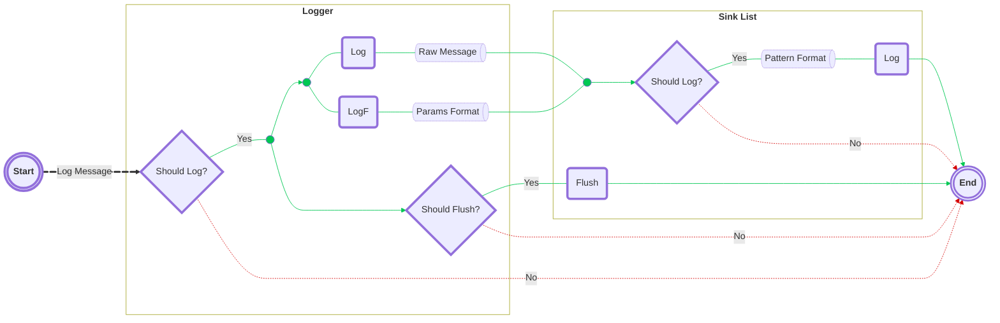

**[English](./readme.md) | [中文](./readme-chi.md)**

# Log4sp

Log4sp is a high‑performance logging library built on [spdlog](https://github.com/gabime/spdlog), supporting both header‑only and extension library usage modes. It is designed to help developers efficiently record, format, and manage application logs. Building upon spdlog’s exceptional performance and flexibility, log4sp provides a more easily integrable logging interface for SourceMod, catering to logging needs ranging from lightweight plugins to large‑scale, high‑performance projects.

With log4sp, developers can easily track plugin behavior, debug issues, and monitor performance without adding significant overhead to their code.

## Features

1. Very fast, much faster than [SourceMod Logging](https://sm.alliedmods.net/new-api/logging).
2. Support log filtering - [log levels](#Log-Levels) can be modified at runtime as well as compile time.
3. Support for large log message - over 1024 characters will not be [truncated](#Format)
4. Support custom [log message pattern](#Pattern).
5. Support logging [no error throwing](#Error-Handler).
6. Support various [sinks (log targets)](./sourcemod/scripting/include/log4sp/sinks).
7. Support console commands and management menus.
8. Support header-only mode (Pure SourcePawn).
9. Support int64
10. Support x64

## Installation

1. Download the appropriate version from [Releases](https://github.com/F1F88/sm-ext-log4sp/releases)
    - `sm-ext-log4sp` contains the extension library and include files for logging-related API.
    - `sm-plugin-log4sp_manager` contains the manager plugin and include files for manager-related API.
2. Uploading "addons/sourcemod" files to the server

## Usage

Natives Documentation: [./sourcemod/scripting/include/log4sp/](./sourcemod/scripting/include/log4sp)

**Hello World**

```sourcepawn
#include <sourcemod>
#include <log4sp>

public void OnPluginStart()
{
    ServerConsoleSink sink = new ServerConsoleSink();
    Logger logger = new Logger("my-logger");
    logger.AddSink(sink);

    logger.Info("Hello World!");

    sink.Close();
    logger.Close();
}
```

Server console output:

> [2001-02-03 12:34:56.789] [my-logger] [info] Hello World!<br>

### Log Levels

Log4sp defines **`7`** log levels, from low to high: **`trace`** < **`debug`** < **`info`** < **`warn`** < **`error`** < **`fatal`** < **`off`**.

Log messages are formatted and delivered to sinks only if message level **≥** logger log level;

Log messages are log to sink only if message level **≥** Sink log level.

Developers can filter logs based on severity, ensuring that only relevant messages are recorded, which improves debugging efficiency and maintains cleaner, more organized log files.

The default log level of **Logger** is `info`;

The default log level of **Sink** is `trace`.

```sourcepawn
logger.SetLevel(LogLevel_Warn);     // Set the logger log level to warn
logger.ShouldLog(LogLevel_Warn);    // true

sink.SetLevel(LogLevel_Debug);      // Set the sink log level to debug
sink.ShouldLog(LogLevel_Trace);     // false
```

```sourcepawn
#include <sourcemod>
#include <log4sp>

public void OnPluginStart()
{
    char path[PLATFORM_MAX_PATH];
    BuildPath(Path_SM, path, sizeof(path), "logs/simple-file.log");
    BasicFileSink sink = new BasicFileSink(path);

    Logger logger = new Logger("my-logger");
    logger.AddSink(sink);
    logger.SetLevel(LogLevel_Warn);

    logger.Debug("Test ...");
    logger.Info("Information ...");
    logger.Warn("Warning ...");
    logger.Error("Oops ...");

    sink.Close();
    logger.Close();
}
```

File `game/addons/sourcemod/logs/simple-file.log`:

> [2001-02-03 12:34:56.789] [my-logger] [warn] Warning ...<br>
> [2001-02-03 12:34:56.789] [my-logger] [error] Oops ...<br>

### Format

Taking [**Logger::Log**](./sourcemod/scripting/include/log4sp/logger.inc#L33) as an example, ordinary `Log` method only output the log message as is, while the `LogF` method will format the parameters first and then output the formatted log message.

Parameters formatting is performed at **Logger** layer and is triggered only if log message level **>=** logger log level.

|                                                              |                          SM Logging                          |                         Header-Only                          |                          Extension                           |
| :----------------------------------------------------------- | :----------------------------------------------------------: | :----------------------------------------------------------: | :----------------------------------------------------------: |
| **Max character**                                            |                             1024                             |          Macro `LOG4SP_HEADER_ONLY_MAX_MSG_LENGTH`           |                          Unlimited                           |
| **Formatter**                                                | [SM Format](https://github.com/alliedmodders/sourcemod/blob/master/core/logic/sprintf.h#L40) | [SM Format](https://github.com/alliedmodders/sourcemod/blob/master/core/logic/sprintf.h#L40) |          [Log4sp Format](./src/log4sp/format.h#L10)          |
| **Usage**                                                    | [Format wiki](https://wiki.alliedmods.net/Format_Class_Functions_(SourceMod_Scripting)) | [Format wiki](https://wiki.alliedmods.net/Format_Class_Functions_(SourceMod_Scripting)) | [Format wiki](https://wiki.alliedmods.net/Format_Class_Functions_(SourceMod_Scripting)) |
| **Format error**                                             |                         Throw error                          |                         Throw error                          |                      Call Error Handler                      |
| **Pads [BUG](https://github.com/alliedmodders/sourcemod/issues/2221)** | Fixed in [1.13.0.7198](https://github.com/alliedmodders/sourcemod/pull/2255) | Fixed in [1.13.0.7198](https://github.com/alliedmodders/sourcemod/pull/2255) |                       Fixed in v1.5.0                        |
| **Float [Inf](https://github.com/alliedmodders/sourcemod/issues/2110)** | Added in [1.13.0.7269](https://github.com/alliedmodders/sourcemod/pull/2324) | Added in [1.13.0.7269](https://github.com/alliedmodders/sourcemod/pull/2324) |                       Added in v1.10.0                       |
| **Symbols [BUG](https://github.com/alliedmodders/sourcemod/issues/2328)** | Fixed in [1.13.0.7270](https://github.com/alliedmodders/sourcemod/pull/2329) | Fixed in [1.13.0.7270](https://github.com/alliedmodders/sourcemod/pull/2329) |                       Fixed in v1.8.0                        |
| **Justify [BUG](https://github.com/alliedmodders/sourcemod/issues/2331)** | Fixed in [1.13.0.7271](https://github.com/alliedmodders/sourcemod/pull/2332) | Fixed in [1.13.0.7271](https://github.com/alliedmodders/sourcemod/pull/2332) |                       Fixed in v1.5.0                        |
| **Specifiers [%E](https://github.com/alliedmodders/sourcemod/issues/2099)** | Added in [1.13.0.7276](https://github.com/alliedmodders/sourcemod/pull/2330) | Added in [1.13.0.7276](https://github.com/alliedmodders/sourcemod/pull/2330) |                       Added in v1.10.0                       |
| **Specifiers [%ld, %li, %lu](https://github.com/alliedmodders/sourcemod/issues/2413)** | Added in [1.13.0.7326](https://github.com/alliedmodders/sourcemod/pull/2421) | Added in [1.13.0.7326](https://github.com/alliedmodders/sourcemod/pull/2421) |                      Added in  v1.11.0                       |
| **Float [-Inf](https://github.com/alliedmodders/sourcemod/issues/2444)** | Added in [1.13.0.7330](https://github.com/alliedmodders/sourcemod/pull/2444) | Added in  [1.13.0.7330](https://github.com/alliedmodders/sourcemod/pull/2444) |                       Added in v1.11.0                       |
| **Pads [BUG](https://github.com/alliedmodders/sourcemod/pull/2443)** | Fixed in [1.13.0.7331](https://github.com/alliedmodders/sourcemod/pull/2443) | Fixed in [1.13.0.7331](https://github.com/alliedmodders/sourcemod/pull/2443) |                       Fixed in v1.8.0                        |
| **Specifiers [%lb, %lX, %lx](https://github.com/alliedmodders/sourcemod/pull/2448)** | Added in [1.13.0.7342](https://github.com/alliedmodders/sourcemod/pull/2448) | Added in [1.13.0.7342](https://github.com/alliedmodders/sourcemod/pull/2448) |                       Added in v1.11.0                       |

```sourcepawn
#include <sourcemod>
#include <log4sp>

public void OnPluginStart()
{
    LoadTranslations("common.phrases");

    char path[PLATFORM_MAX_PATH];
    BuildPath(Path_SM, path, sizeof(path), "logs/daily-file.log");
    DailyFileSink sink = new DailyFileSink(path);

    Logger logger = new Logger("my-logger");
    logger.AddSink(sink);

    logger.InfoF("d: %d, u: %u, b: %b", 1, 2, 3);
    logger.WarnF("f: %f, x: %x, X: %X", 4.0, 5, 6);
    logger.ErrorF("s: %s, c: %c, T: %T", "Some String", '!', "Yes", LANG_SERVER);

    sink.Close();
    logger.Close();
}
```

File `game/addons/sourcemod/logs/daily-file_20010203.log`:

> [2001-02-03 12:34:56.789] [my-logger] [info] d: 1, u: 2, b: 11<br>
> [2001-02-03 12:34:56.789] [my-logger] [warn] f: 4.000000, x: 5, X: 6<br>
> [2001-02-03 12:34:56.789] [my-logger] [error] s: Some String, c: !, T: Yes<br>

### Pattern

Log message pattern is a configuration mechanism for formatting log messages, allowing customization of the log presentation style through metadata fields such as timestamps, severity levels, and logger names.

Pattern formatting is performed at the **Sink** layer, which first parses and renders the template before outputting the formatted log message.

Sink default pattern and sample outputs are:

```
[%Y-%m-%d %H:%M:%S.%e] [%n] [%l] [%s:%#] %v
```

```
[2001-01-01 12:34:56.789] [log4sp] [info] [example.sp:123] Hello World!
```

```sourcepawn
sink.SetPattern("[%Y-%m-%d %H:%M:%S] [%n] [%l] %v 1");   // Setting the pattern for single sink
logger.SetPattern("[%Y-%m-%d %H:%M:%S] [%n] [%l] %v 2"); // Setting the pattern for all sinks
```

All pattern flags see: [\<spdlog wiki> - Custom-formatting](https://github.com/gabime/spdlog/wiki/Custom-formatting#pattern-flags)

```sourcepawn
#include <sourcemod>
#include <log4sp>

public void OnPluginStart()
{
    LoadTranslations("common.phrases");

    char path[PLATFORM_MAX_PATH];
    BuildPath(Path_SM, path, sizeof(path), "logs/rotate-file.log");
    const int maxFileSize = 1024 * 10;
    const int maxFiles = 3;
    RotatingFileSink sink = new RotatingFileSink(path, maxFileSize, maxFiles);

    Logger logger = new Logger("my-logger");
    logger.AddSink(sink);

    logger.LogSrc(LogLevel_Info, "Some message");
    logger.SetPattern("[%D %r] [%n] [%L] [%!:%#] %v");
    logger.LogSrc(LogLevel_Info, "Some message");

    sink.Close();
    logger.Close();
}
```

File `game/addons/sourcemod/logs/rotate-file.log`:

> [2001-02-03 12:34:56.789] [my-logger] [info] [test.sp:17] Some message<br>
> [02/03/01 12:34:56 PM] [my-logger] [I] [OnPluginStart:19] Some message<br>

> [!tip]
>
> Header-only uses a fixed pattern.

### Flush Policy

Log4sp lets the underlying libc flush whenever [it sees fit](https://github.com/gabime/spdlog/wiki/Flush-policy) in order to achieve good performance.

You can override this with:

1. Manual flush

    ```sourcepawn
    sink.Flush();   // Flush single sink contents
    logger.Flush(); // Flush all sinks contents
    ```

2. Flush levels

    ```sourcepawn
    logger.SetFlushLevel(LogLevel_Warn);  // Flush contents immediately when log message level ≥ "Warn"
    ```

    > [!tip]
    >
    > The default auto-flush level for Logger is LogLevel_Off (auto-flush is disabled).

3. Interval based flush

    ```sourcepawn
    #include <sourcemod>
    #include <log4sp>

    Logger g_hLogger;

    public void OnPluginStart()
    {
        g_hLogger = new Logger("my-logger");
        CreateTimer(5.0, Timer_Flush, _, TIMER_REPEAT);
    }

    Action Timer_Flush(Handle timer)
    {
        g_hLogger.Flush();
        return Plugin_Continue;
    }
    ```

### Error Handler

Normally, Log4sp Natives will throw an error and interrupt code execution when the parameters are invalid.

However, in the following situations, errors will not be thrown directly, but instead the error handler will be called:

1. Error when Logger.LogF formats parameters;

2. Error when Logger traverses Sinks to log;

3. Error when Logger traverses Sinks to flush.

Each Logger has an error handler, and the default handler solution is to simply log the error information to the SourceMod's errors.log file.

You can refer to the following code to override the default error handler of the Logger:

```sourcepawn
void SetMyErrorHandler(Logger logger)
{
    logger.SetErrorHandler(null, MyErrorHandler);
}

void MyErrorHandler(const char[] origin, SourceLoc loc, const char[] msg)
{
    // source takes the filename and appends the line number.
    char source[PLATFORM_MAX_PATH];
    if (!loc.IsEmpty())
    {
        int sepOffset = 0;
        for (int i = 0; i < sizeof(SourceLoc::filename); ++i)
        {
            if (!loc.filename[i])
                break;
            if (loc.filename[i] == '\\' || loc.filename[i] == '/')
                sepOffset = i + 1;
        }
        FormatEx(source, sizeof(source), "[%s::%d] ",
                 loc.filename[sepOffset], loc.line);
    }
    LogError("[%s] %s%s", origin, source, msg);
}
```

> [!tip]
>
> In header-only mode, formatting parameter errors in `Logger.LogF` will directly throw an error message.

### Multiple Sinks

The library supports sending log messages to a variety of destinations, including the console, files, and custom sinks. This gives developers complete control over log storage, visibility, and accessibility, making it easier to monitor, maintain, and troubleshoot applications.

```sourcepawn
#include <sourcemod>
#include <log4sp>

public void OnPluginStart()
{
    char basicFile[PLATFORM_MAX_PATH], dailyFile[PLATFORM_MAX_PATH], rotatingFile[PLATFORM_MAX_PATH];
    BuildPath(Path_SM, basicFile, sizeof(basicFile), "logs/log4sp-multi-basic-sink.log");
    BuildPath(Path_SM, dailyFile, sizeof(dailyFile), "logs/log4sp-multi-daily-sink.log");
    BuildPath(Path_SM, rotatingFile, sizeof(rotatingFile), "logs/log4sp-multi-rotating-sink.log");

    BasicFileSink basicFileSink = new BasicFileSink(basicFile);
    DailyFileSink dailyFileSink = new DailyFileSink(dailyFile);
    RotatingFileSink rotatingFileSink = new RotatingFileSink(rotatingFile, 10, 10);
    ServerConsoleSink serverConsoleSink = new ServerConsoleSink();

    Logger logger = new Logger("multi-sink-logger");
    logger.AddSink(basicFileSink);
    logger.AddSink(dailyFileSink);
    logger.AddSink(rotatingFileSink);
    logger.AddSink(serverConsoleSink);

    logger.Info("Some message");
    logger.Warn("Some warning");

    basicFileSink.Close();
    dailyFileSink.Close();
    rotatingFileSink.Close();
    serverConsoleSink.Close();
    logger.Close();
}
```

File `game/addons/sourcemod/logs/log4sp-multi-basic-sink.log`:

> [2001-02-03 12:34:56.789] [multi-sink-logger] [info] Some message<br>
> [2001-02-03 12:34:56.789] [multi-sink-logger] [warn] Some warning<br>

File `game/addons/sourcemod/logs/log4sp-multi-daily-sink_20010203.log`:

> [2001-02-03 12:34:56.789] [multi-sink-logger] [info] Some message<br>
> [2001-02-03 12:34:56.789] [multi-sink-logger] [warn] Some warning<br>

File `game/addons/sourcemod/logs/log4sp-multi-rotating-sink.1.log`:

> [2001-02-03 12:34:56.789] [multi-sink-logger] [info] Some message<br>

File `game/addons/sourcemod/logs/log4sp-multi-rotating-sink.log`:

> [2001-02-03 12:34:56.789] [multi-sink-logger] [warn] Some warning<br>

Server console:

> [2001-02-03 12:34:56.789] [multi-sink-logger] [info] Some message<br>
> [2001-02-03 12:34:56.789] [multi-sink-logger] [warn] Some warning<br>

### Header Only

All code for the header‑only mode is implemented in `.inc` header files, with no dependency on any external components. It can be easily integrated into any plugin, thereby simplifying the setup and integration process.

To use the header‑only mode, you must define the macro `LOG4SP_HEADER_ONLY` before including the `<log4sp>` header. Alternatively, you can enable it by adding the following compile‑time flag: `LOG4SP_HEADER_ONLY=`.

```sourcepawn
#include <sourcemod>

#define LOG4SP_HEADER_ONLY  // Enable header‑only
#include <log4sp>

public void OnPluginStart()
{
    ServerConsoleSink sink = new ServerConsoleSink();

    Logger logger = new Logger("my-logger");
    logger.AddSink(sink);

    logger.Info("Hello World!");

    sink.Close();
    logger.Close();
}
```

The main differences between header-only mode and extension library mode are as follows:

|                                         |     Extension      |                         Header-only                          |
| :-------------------------------------- | :----------------: | :----------------------------------------------------------: |
| **LibraryExists("log4sp")**             |        True        |                            False                             |
| **Log message max character**           |     Unlimited      |          Macro `LOG4SP_HEADER_ONLY_MAX_MSG_LENGTH`           |
| **Parameter Formatting Error Handling** | Call Error Handler |              Not supported<br/>（Throw error）               |
| **Customized Pattern**                  |      Support       |      Not supported<br>(Modifying requires code changes)      |
| **Clone Handle**                        |      Support       | Limited<br>(Only the `Clone` method of methodmap can be used)<br/>(Clones are also corrupted when the creator is uninstalled) |
| **Close Handle**                        |      Support       | Limited<br>(Only the `Close` method of methodmap can be used)<br/>(Both `delete` and `CloseHandle()` leak handles) |
| **Requirement**                         |      SM 1.12       |                           SM 1.11                            |

### Cleaning Up Instances

In the extended library, instances can be cleaned up directly using the `delete` keyword.

The header-only mode is similar to [sm-json](https://github.com/clugg/sm-json). It uses `StringMap` under the hood, you need to make sure you manage your memory properly by cleaning up instances when you're done with them. Simply using the `delete` keyword is insufficient, as there may be nested `ArrayList`, `PrivateForward`, `File`, etc. Handles. You need to use the `Close()` method of the corresponding `methodmap`, which will clean up and delete all handles.

Additionally, there are some global helper function `LoggerCloseAndDelete()`, `LoggersCloseAndDelete()`, `SinkCloseAndDelete()`, `SinksCloseAndDelete()`, which first call the `Close()` method of the corresponding `methodmap`, and then set the passed variable or array element to `null`.

```sourcepawn
logger.Close();
logger = null;
// or
LoggerCloseAndDelete(logger);

sink.Close();
sink = null;
// or
SinkCloseAndDelete(sink);
```

If a shared Handle has multiple references, it will only be truly cleaned up after the reference count reaches zero.

For the Logger Handle, calling the `Logger.Clone()` method and registering with the `Registry` will increase the reference count; calling `Logger.Close()` and unregistering from the `Registry` will decrease the reference count.

For the Sink object, calling the `Sink.Clone()` method and adding it to the `Logger` will increase the reference count; calling `Sink.Close()` and removing it from the `Logger` will decrease the reference count.

## Flowchart


```mermaid
flowchart LR
 subgraph Sinks["`**Sink List**`"]
        SinkShouldJunction["Junction"]
        SinkShouldLog{"Should Log?"}
        SinkLog("Log")
        SinkPatternFormat["Pattern Format"]
        SinkFlush("Flush")
  end
 subgraph Logger["`**Logger**`"]
        LoggerShouldLog{"Should Log?"}
        LoggerShouldJunction["Junction"]
        LoggerLogJunction["Junction"]
        LoggerShouldFlush{"Should Flush?"}
        LoggerLog("Log")
        LoggerLogRaw["Raw Message"]
        LoggerLogF("LogF")
        LoggerLogFFormat["Params Format"]
  end
    Start((("`**Start**`"))) L_Start_LoggerShouldLog_0@== Log Message ==> LoggerShouldLog
    LoggerShouldLog -- Yes --- LoggerShouldJunction
    LoggerShouldJunction --> LoggerLogJunction & LoggerShouldFlush
    LoggerShouldLog -. No .-> Stop((("`**End**`")))
    LoggerLogJunction --- LoggerLog & LoggerLogF
    LoggerLog --- LoggerLogRaw
    LoggerLogRaw --- SinkShouldJunction
    LoggerLogF --- LoggerLogFFormat
    LoggerLogFFormat --- SinkShouldJunction
    LoggerShouldFlush -- Yes --- SinkFlush
    SinkFlush --> Stop
    LoggerShouldFlush -. No .-> Stop
    SinkShouldJunction --> SinkShouldLog
    SinkShouldLog -- Yes --- SinkPatternFormat
    SinkPatternFormat --- SinkLog
    SinkLog --> Stop
    SinkShouldLog -. No .-> Stop

    L_Start_LoggerShouldLog_0@{ animation: fast }
    LoggerShouldJunction@{ shape: junction}
    LoggerLogJunction@{ shape: junction}
    LoggerLogRaw@{ shape: das}
    LoggerLogFFormat@{ shape: das}
    SinkShouldJunction@{ shape: junction}
    SinkPatternFormat@{ shape: das}
    style Start stroke-width:4px,stroke-dasharray: 0,font-size:16px
    style Logger fill:transparent
    style LoggerShouldLog stroke-width:4px,stroke-dasharray: 0
    style LoggerShouldJunction fill:#00C853
    style LoggerLogJunction fill:#00C853
    style LoggerLog stroke-width:4px,stroke-dasharray: 0
    style LoggerLogRaw stroke-width:1px,stroke-dasharray:1
    style LoggerLogF stroke-width:4px,stroke-dasharray: 0
    style LoggerLogFFormat stroke-width:1px,stroke-dasharray:1
    style LoggerShouldFlush stroke-width:4px,stroke-dasharray: 0
    style Sinks fill:transparent
    style SinkShouldJunction fill:#00C853
    style SinkShouldLog stroke-width:4px,stroke-dasharray: 0
    style SinkPatternFormat stroke-width:1px,stroke-dasharray:1
    style SinkLog stroke-width:4px,stroke-dasharray: 0
    style SinkFlush stroke-width:4px,stroke-dasharray: 0
    style Stop stroke-width:3px,stroke-dasharray: 0
    linkStyle 1 stroke:#00C853,fill:none
    linkStyle 2 stroke:#00C853,fill:none
    linkStyle 3 stroke:#00C853,fill:none
    linkStyle 4 stroke:#D50000,fill:none
    linkStyle 5 stroke:#00C853,fill:none
    linkStyle 6 stroke:#00C853,fill:none
    linkStyle 7 stroke:#00C853,fill:none
    linkStyle 8 stroke:#00C853,fill:none
    linkStyle 9 stroke:#00C853,fill:none
    linkStyle 10 stroke:#00C853,fill:none
    linkStyle 11 stroke:#00C853,fill:none
    linkStyle 12 stroke:#00C853,fill:none
    linkStyle 13 stroke:#D50000,fill:none
    linkStyle 14 stroke:#00C853,fill:none
    linkStyle 15 stroke:#00C853,fill:none
    linkStyle 16 stroke:#00C853,fill:none
    linkStyle 17 stroke:#00C853,fill:none
    linkStyle 18 stroke:#D50000,fill:none
```

## Plugins

### Manager

The **log4sp_manager** plugin provides various management options for managing the logging behavior of each plugin, you just need to register the logger to the registry first.

These loggers can then be managed using Registry Natives, menus or console commands.

- Register Logger

    ```sourcepawn
    #include <sourcemod>
    #include <log4sp>
    #include <log4sp/registry>

    public void OnPluginStart()
    {
        if (Log4spRegistry.LibraryExists())
        {
            Logger logger = new Logger("my-logger");
            Log4spRegistry.Instance().RegisterLogger(logger);
            logger.Close();
        }
    }

    public void OnPluginEnd()
    {
        // Drop it when your plugin unloads.
        Log4spRegistry.Instance().Drop("my-logger");
    }
    ```

- Get Logger

    ```sourcepawn
    #include <sourcemod>
    #include <log4sp>
    #include <log4sp/registry>

    public void OnPluginStart()
    {
        if (Log4spRegistry.LibraryExists())
        {
            Logger logger = Log4spRegistry.Instance().Get("my-logger");
            if (logger != INVALID_HANDLE)
            {
                logger.Info("Some message");
            }
        }
    }
    ```

- Global Logger

    When the plugin loads, a logger with the empty name "" is created as the global logger; the global logger has a **ServerConsoleSink** and the rest are defaults and can be used directly by any plugin.

    You can also create a logger by yourself and replace it with the global logger.

    ```sourcepawn
    #include <sourcemod>
    #include <log4sp>
    #include <log4sp/registry>

    public void OnPluginStart()
    {
        if (Log4spRegistry.LibraryExists())
        {
            Logger logger = new Logger("my-logger");
            Log4spRegistry.Instance().SetGlobalLogger(logger);
            logger.Close();
        }
    }
    ```

- Modify all logger properties in the registry

    ```sourcepawn
    #include <sourcemod>
    #include <log4sp>
    #include <log4sp/registry>

    public void OnPluginStart()
    {
        if (Log4spRegistry.LibraryExists())
        {
            // Set the logger log level of all loggers in the registry to Warn
            Log4spRegistry.Instance().SetLevel(LogLevel_Warn);

            // Set the logger flush level of all loggers in the registry to Error
            Log4spRegistry.Instance().SetFlushLevel(LogLevel_Error);
        }
    }
    ```

- Regularly flush all loggers in the registry.

    In the [Flush Policy](#Flush Policy) section, periodic refreshes require you to write your own code to implement, and the solution is not elegant.

    A similar effect can be easily achieved with the manager plugin:

    ```sourcepawn
    #include <sourcemod>
    #include <log4sp/registry>

    public void OnPluginStart()
    {
        if (Log4spRegistry.LibraryExists())
        {
            // Flush all loggers in the registry every 5 seconds
            Log4spRegistry.Instance().SetFlushEvery(5.0);
        }
    }
    ```


## Benchmarks

Test platform: Windows 11 + VMware + Ubuntu 24.04 LTS + SourceMod 1.13.0.7410

Host configuration: Intel(R) Core(TM) Ultra 7 255H + 32 GB Memory

VM Ubuntu configuration: 8 vCPU (1 socket × 8 cores) + 8 GB Memory

Test case: [./sourcemod/scripting/testsuite/bench/bench-log4sp.sp](./sourcemod/scripting/testsuite/bench/bench-log4sp.sp)

```shell
*****************************************************************************
* Bench log4sp v2.0.0  (release,git=d6a93cc,manual)                         *
*****************************************************************************
basic-file       Runs: 10   Calls: 10000000   Elapsed: 1.535      6511315/sec
callback         Runs: 10   Calls: 10000000   Elapsed: 3.064      3262996/sec
daily-file       Runs: 10   Calls: 10000000   Elapsed: 1.582      6318177/sec
ring-buffer      Runs: 10   Calls: 10000000   Elapsed: 0.750     13326972/sec
rotate-file      Runs: 10   Calls: 10000000   Elapsed: 1.379      7248320/sec
server-console   Runs: 10   Calls: 10000000   Elapsed: 22.818      438239/sec

*****************************************************************************
* Bench log4sp v2.0.0  (header-only,release,max-err=256,max-msg=1024)       *
*****************************************************************************
basic-file       Runs: 10   Calls: 10000000   Elapsed: 26.465      377856/sec
callback         Runs: 10   Calls: 10000000   Elapsed: 8.380      1193266/sec
daily-file       Runs: 10   Calls: 10000000   Elapsed: 28.817      347016/sec
ring-buffer      Runs: 10   Calls: 10000000   Elapsed: 299.795      33356/sec
rotate-file      Runs: 10   Calls: 10000000   Elapsed: 28.216      354407/sec
server-console   Runs: 10   Calls: 10000000   Elapsed: 48.795      204938/sec
```

As a reference, [SourceMod - Logging](https://sm.alliedmods.net/new-api/logging) was also tested

Test case: [./sourcemod/scripting/testsuite/bench/bench-sm-logging.sp](./sourcemod/scripting/testsuite/bench/bench-sm-logging.sp)

```
[benchmark] LogMessage      Runs: 10   Calls: 10000000   Elapsed: 58.743    170230/sec
[benchmark] LogToFile       Runs: 10   Calls: 10000000   Elapsed: 54.598    183156/sec
[benchmark] LogToFileEx     Runs: 10   Calls: 10000000   Elapsed: 53.439    187128/sec
[benchmark] PrintToServer   Runs: 10   Calls: 10000000   Elapsed: 18.596    537744/sec
```

## Build

### Linux

1. Download dependencies and project files

    ```bash
    mkdir alliedmodders && cd alliedmodders
    git clone https://github.com/alliedmodders/ambuild
    git clone --recursive https://github.com/alliedmodders/sourcemod -b 1.12-dev
    git clone https://github.com/F1F88/sm-ext-log4sp.git
    ```

2. Install AMBuild

    ```bash
    pip install ./ambuild
    ```

3. Build

    ```bash
    mkdir sm-ext-log4sp/build && cd sm-ext-log4sp/build
    python3 ../configure.py --enable-optimize --sm-path ../../sourcemod --targets=x86,x64
    ambuild
    ```

    > [!tip]
    > Local builds are able to enable [additional optimizations](./AMBuildScript#L233)

### Windows

1. Install Visual Studio、Python、Git (See [Building SourceMod](https://wiki.alliedmods.net/Building_sourcemod#Windows))

2. Download dependencies and project files

    ```cmd
    mkdir alliedmodders && cd alliedmodders
    git clone https://github.com/alliedmodders/ambuild
    git clone --recursive https://github.com/alliedmodders/sourcemod -b 1.12-dev
    git clone https://github.com/F1F88/sm-ext-log4sp.git
    ```

3. Install AMBuild

    ```cmd
    pip install ./ambuild
    ```

4. Build (In the Developer Command Prompt environment)

    ```cmd
    mkdir sm-ext-log4sp/build && cd sm-ext-log4sp/build
    python3 ../configure.py --enable-optimize --sm-path ../../sourcemod --targets=x86
    ambuild
    ```

## FAQ

### AMBuild

error: externally-managed-environment

```shell
# ref: https://blog.csdn.net/2202_75762088/article/details/134625775
# Ubuntu does not have pip installed by default
sudo apt install python3-pip
# Try installing AMBuild again
pip install ./ambuild --break-system-packages
```

### Extension library

#### Build Problem

Linux switch clang/gcc compiler

```shell
export CC=clang
export CXX=clang++
```

Unable to find a suitable CXX compiler

```shell
# ref: https://blog.csdn.net/weixin_38939826/article/details/105174347
sudo yum install gcc-c++ libstdc++-devel
```

gnu/stubs-32.h: No such file or directory

```shell
# ref: https://blog.csdn.net/wang_xijue/article/details/47128423
sudo yum install glibc-devel.i686
```

bits/c++config.h: No such file or directory

```shell
# ref: https://blog.csdn.net/Edidaughter/article/details/122627186
sudo apt-get install gcc-multilib g++-multilib
```

/usr/bin/ld: cannot find -lstdc++

> Remove "[cxx.linkflags += \['-static-libstdc++']](./AMBuildScript#L306)" in **`AMBuildScript`** file

#### Runtime Problem

[SM] Unable to load extension "log4sp.ext": Could not find interface

> Check if the `extension library` version matches the operating system
>
> Check if the `extension library` version matches the SourceMod version

bin/libstdc++.so.6: version 'GLIBCXX_3.4.20' not found

> See: [#6](https://github.com/F1F88/sm-ext-log4sp/issues/6)

### Plugins

#### Build Problem

error 139: could not find type "Logger"

> Check if `#include <log4sp>` is missing in the scripting code files
>
> Check whether the Log4sp includes file is missing in the compilation environment
>
> Check if the Log4sp includes file version is outdated

#### Runtime Problem

[SM] Unable to load plugin "....smx": Required extension "Log4sp" file("log4sp.ext") not running

> Check if the `log4sp.ext` extension library file is missing in the server `"addons/sourcemod/extensions"` folder

**The log file remains empty**

> See: [\<spdlog wiki> FAQ](https://github.com/gabime/spdlog/wiki/FAQ#the-log-file-remains-empty)

## Credits

- **[gabime's](https://github.com/gabime) [spdlog](https://github.com/gabime/spdlog)** project implements most of the functionality, and log4sp wraps it into sourcemod natives.
- Fyren, nosoop, Deathreus provides a solution for managing the sink handle.

- [blueblur0730](https://github.com/blueblur0730), Digby helped improve the traversal operation of all loggers.

- Bakugo, Anonymous Player, Fyren help fix crash with asynchronous calls to sourcepawn.

- [blueblur0730](https://github.com/blueblur0730) added log4sp_manager plugin.

If I missed anyone, please contact me.
