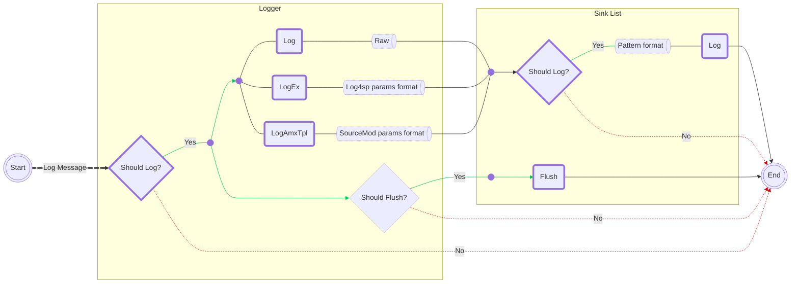

**[English](./readme.md) | [中文](./readme-chi.md)**

# Log4sp

Log4sp is a high‑performance logging library built on [spdlog](https://github.com/gabime/spdlog). It is designed to help developers efficiently record, format, and manage application logs. Building upon spdlog’s exceptional performance and flexibility, log4sp provides a more easily integrable logging interface for SourceMod, catering to logging needs ranging from lightweight plugins to large‑scale, high‑performance projects.

With log4sp, developers can easily track plugin behavior, debug issues, and monitor performance without adding significant overhead to their code.


## Features

1. Very fast, much faster than [SourceMod Logging](https://sm.alliedmods.net/new-api/logging).
2. Support log filtering - [log levels](#Log-Levels) can be modified at runtime as well as compile time.
3. Support for large log message - over [1024](https://github.com/alliedmodders/sourcemod/blob/be89b25d96486900a57e07661f992836479f4fc4/core/logic/smn_filesystem.cpp#L936-L970) characters will not be [truncated](#Format)
4. Support custom [log message pattern](#Pattern).
5. Support logging [no error throwing](#Error-Handler).
6. Support various [sinks (log targets)](./sourcemod/scripting/include/log4sp/sinks).
7. Support console commands and management menus.
8. Support int64.
9. Support x64.

## Installation

1. Download the appropriate version from [Releases](https://github.com/F1F88/sm-ext-log4sp/releases)
    - `sm-ext-log4sp` contains the extension file and scripting include files.
    - `sm-plugin-log4sp_manager` plugin adds user commands and menus to manage logger (depends on extension)
2. Uploading "addons/sourcemod" files to the server

## Usage

Natives Documentation: [./sourcemod/scripting/include/log4sp/](./sourcemod/scripting/include/log4sp)

**Hello World**

```sourcepawn
#include <sourcemod>
#include <log4sp>

public void OnPluginStart()
{
    ServerConsoleSink sink = new ServerConsoleSink();
    Logger logger = new Logger("my-logger");
    logger.AddSink(sink);

    logger.Info("Hello World!");

    sink.Close();
    logger.Close();
}
```

Server console output:

> [2001-02-03 12:34:56.789] [my-logger] [info] Hello World!<br>

### Log Levels

Log4sp defines **`7`** log levels, from low to high: **`trace`** < **`debug`** < **`info`** < **`warn`** < **`error`** < **`fatal`** < **`off`**.

Log messages are formatted and delivered to sinks only if message level **≥** logger log level;

Log messages are log to sink only if message level **≥** Sink log level.

Developers can filter logs based on severity, ensuring that only relevant messages are recorded, which improves debugging efficiency and maintains cleaner, more organized log files.

The default log level of **Logger** is `info`;

The default log level of **Sink** is `trace`.

```sourcepawn
logger.SetLevel(LogLevel_Warn);     // Set the logger log level to warn
logger.ShouldLog(LogLevel_Warn);    // true

sink.SetLevel(LogLevel_Debug);      // Set the sink log level to debug
sink.ShouldLog(LogLevel_Trace);     // false
```

```sourcepawn
#include <sourcemod>
#include <log4sp>

public void OnPluginStart()
{
    char path[PLATFORM_MAX_PATH];
    BuildPath(Path_SM, path, sizeof(path), "logs/simple-file.log");
    BasicFileSink sink = new BasicFileSink(path);

    Logger logger = new Logger("my-logger");
    logger.AddSink(sink);
    logger.SetLevel(LogLevel_Warn);

    logger.Debug("Test ...");
    logger.Info("Information ...");
    logger.Warn("Warning ...");
    logger.Error("Oops ...");

    sink.Close();
    logger.Close();
}
```

File `game/addons/sourcemod/logs/simple-file.log`:

> [2001-02-03 12:34:56.789] [my-logger] [warn] Warning ...<br>
> [2001-02-03 12:34:56.789] [my-logger] [error] Oops ...<br>

### Format

Taking [**Logger::Log**](./sourcemod/scripting/include/log4sp/logger.inc#L165) as an example, ordinary `Log` method only output the log message as is, while the `LogEx` and `LogAmxTpl` method will format the parameters first and then output the formatted log message.

Parameters formatting is performed at **Logger** layer and is triggered only if log message level **>=** logger log level.

|                                                              |    Log    |                            LogEx                             |                          LogAmxTpl                           |                       SM - LogMessage                        |
| :----------------------------------------------------------- | :-------: | :----------------------------------------------------------: | :----------------------------------------------------------: | :----------------------------------------------------------: |
| **Speed**                                                    | Very Fast |                             Fast                             |                             Fast                             |                             Slow                             |
| **Max character**                                            | unlimited |                          unlimited                           |                             2048                             |                             1024                             |
| **Param format**                                             |     ×     |                              √                               |                              √                               |                              √                               |
| **Formatter**                                                |     ×     |            [Log4sp Format](./src/log4sp/format.h)            | [SM Format](https://github.com/alliedmodders/sourcemod/blob/master/core/logic/sprintf.h#L40) | [SM Format](https://github.com/alliedmodders/sourcemod/blob/master/core/logic/sprintf.h#L40) |
| **Usage**                                                    |     ×     | [Format wiki](https://wiki.alliedmods.net/Format_Class_Functions_(SourceMod_Scripting)) | [Format wiki](https://wiki.alliedmods.net/Format_Class_Functions_(SourceMod_Scripting)) | [Format wiki](https://wiki.alliedmods.net/Format_Class_Functions_(SourceMod_Scripting)) |
| **Format error**                                             |     ×     |                  Handover to Error Handler                   |                         Throw error                          |                         Throw error                          |
| **Pads [BUG](https://github.com/alliedmodders/sourcemod/issues/2221)** |     ×     |                       Fixed in v1.5.0                        |                       Fixed in v1.5.0                        | Fixed in [1.13.0.7198](https://github.com/alliedmodders/sourcemod/pull/2255) |
| **Float [Inf](https://github.com/alliedmodders/sourcemod/issues/2110)** |     ×     |                       Fixed in v1.10.0                       |                       Fixed in v1.10.0                       | Fixed in [1.13.0.7269](https://github.com/alliedmodders/sourcemod/pull/2324) |
| **Symbols [BUG](https://github.com/alliedmodders/sourcemod/issues/2328)** |     ×     |                       Fixed in v1.8.0                        |                       Fixed in v1.8.0                        | Fixed in [1.13.0.7270](https://github.com/alliedmodders/sourcemod/pull/2329) |
| **Justify [BUG](https://github.com/alliedmodders/sourcemod/issues/2331)** |     ×     |                       Fixed in v1.5.0                        |                       Fixed in v1.5.0                        | Fixed in [1.13.0.7271](https://github.com/alliedmodders/sourcemod/pull/2332) |
| **Specifiers [%E](https://github.com/alliedmodders/sourcemod/issues/2099)** |     ×     |                       Added in v1.10.0                       |                       Added in v1.10.0                       | Added in [1.13.0.7276](https://github.com/alliedmodders/sourcemod/pull/2330) |
| **Specifiers [%ld, %li, %lu](https://github.com/alliedmodders/sourcemod/issues/2413)** |     ×     |                       Added in v1.11.0                       |                       Added in v1.11.0                       | Added in [1.13.0.7326](https://github.com/alliedmodders/sourcemod/pull/2421) |
| **Float [-Inf](https://github.com/alliedmodders/sourcemod/issues/2444)** |     ×     |                       Added in v1.11.0                       |                       Added in v1.11.0                       | Added in [1.13.0.7330](https://github.com/alliedmodders/sourcemod/pull/2444) |
| **Pads [BUG](https://github.com/alliedmodders/sourcemod/pull/2443)** |     ×     |                       Fixed in v1.8.0                        |                       Fixed in v1.8.0                        | Fixed in [1.13.0.7331](https://github.com/alliedmodders/sourcemod/pull/2443) |
| **Specifiers [%lb, %lX, %lx](https://github.com/alliedmodders/sourcemod/pull/2448)** |     ×     |                       Added in v1.11.0                       |                       Added in v1.11.0                       | Added in [1.13.0.7342](https://github.com/alliedmodders/sourcemod/pull/2448) |


```sourcepawn
#include <sourcemod>
#include <log4sp>

public void OnPluginStart()
{
    LoadTranslations("common.phrases");

    char path[PLATFORM_MAX_PATH];
    BuildPath(Path_SM, path, sizeof(path), "logs/daily-file.log");
    DailyFileSink sink = new DailyFileSink(path);

    Logger logger = new Logger("my-logger");
    logger.AddSink(sink);

    logger.InfoEx("d: %d, u: %u, b: %b", 1, 2, 3);
    logger.WarnEx("f: %f, x: %x, X: %X", 4.0, 5, 6);
    logger.ErrorEx("s: %s, c: %c, T: %T", "Some String", '!', "Yes", LANG_SERVER);

    sink.Close();
    logger.Close();
}
```

File `game/addons/sourcemod/logs/daily-file_20010203.log`:

> [2001-02-03 12:34:56.789] [my-logger] [info] d: 1, u: 2, b: 11<br>
> [2001-02-03 12:34:56.789] [my-logger] [warn] f: 4.000000, x: 5, X: 6<br>
> [2001-02-03 12:34:56.789] [my-logger] [error] s: Some String, c: !, T: Yes<br>

### Pattern

Log message pattern is a configuration mechanism for formatting log messages, allowing customization of the log presentation style through metadata fields such as timestamps, severity levels, and logger names.

Pattern formatting is performed at the **Sink** layer, which first parses and renders the template before outputting the formatted log message.

Sink default pattern and sample outputs are:

```
[%Y-%m-%d %H:%M:%S.%e] [%n] [%l] [%s:%#] %v
```

```
[2001-02-03 12:34:56.789] [my-logger] [info] [example.sp:123] Hello World!
```

```sourcepawn
sink.SetPattern("[%Y-%m-%d %H:%M:%S] [%n] [%l] %v 1");   // Setting the pattern for single sink
logger.SetPattern("[%Y-%m-%d %H:%M:%S] [%n] [%l] %v 2"); // Setting the pattern for all sinks
```

All pattern flags see: [\<spdlog wiki> - Custom-formatting](https://github.com/gabime/spdlog/wiki/Custom-formatting#pattern-flags)

```sourcepawn
#include <sourcemod>
#include <log4sp>

public void OnPluginStart()
{
    LoadTranslations("common.phrases");

    char path[PLATFORM_MAX_PATH];
    BuildPath(Path_SM, path, sizeof(path), "logs/rotate-file.log");
    const int maxFileSize = 1024 * 10;
    const int maxFiles = 3;
    RotatingFileSink sink = new RotatingFileSink(path, maxFileSize, maxFiles);

    Logger logger = new Logger("my-logger");
    logger.AddSink(sink);

    logger.LogSrc(LogLevel_Info, "Some message");
    logger.SetPattern("[%D %r] [%n] [%L] [%!:%#] %v");
    logger.LogSrc(LogLevel_Info, "Some message");

    sink.Close();
    logger.Close();
}
```

File `game/addons/sourcemod/logs/rotate-file.log`:

> [2001-02-03 12:34:56.789] [my-logger] [info] [test.sp:17] Some message<br>
> [02/03/01 12:34:56 PM] [my-logger] [I] [OnPluginStart:19] Some message<br>

### Flush Policy

Log4sp lets the underlying libc flush whenever it sees fit in order to achieve good performance.

You can override this with:

1. Manual flush

    ```sourcepawn
    sink.Flush();   // Flush single sink contents
    logger.Flush(); // Flush all sinks contents
    ```

2. Flush levels

    ```sourcepawn
    logger.FlushOn(LogLevel_Warn);  // Flush contents immediately when log message level ≥ "Warn"
    ```

    > [!tip]
    >
    > The default auto-flush level for Logger is LogLevel_Off (auto-flush is disabled).

3. Interval based flush

    ```sourcepawn
    #include <sourcemod>
    #include <log4sp>

    public void OnPluginStart()
    {
        CreateTimer(5.0, Timer_FlushAll, _, TIMER_REPEAT);
    }

    Action Timer_FlushAll(Handle timer)
    {
        Logger.ApplyAll(ApplyAll_FlushAll);
        return Plugin_Continue;
    }

    void ApplyAll_FlushAll(Logger logger)
    {
        logger.Flush();
    }
    ```

### Error Handler

Normally, Log4sp natives will throw an error and interrupt code execution when the parameters are invalid.

However, in the following situations, errors will not be thrown directly, but instead the error handler will be called:

1. Error when Logger.LogEx formats parameters;

2. Error when Logger traverses Sinks to log;

3. Error when Logger traverses Sinks to flush.

Each Logger has an error handler, and the default handler solution is to simply log the error information to the SourceMod's errors.log file.

You can refer to the following code to override the default error handler of the Logger:

```sourcepawn
void SetMyErrorHandler(Logger logger)
{
    logger.SetErrorHandler(MyErrorHandler);
}

void MyErrorHandler(const char[] msg, const char[] name, const char[] file, int line, const char[] func)
{
    LogError("[%s::%d] [%s] %s", file, line, name, msg);
}
```

> [!tip]
>
> Parameter formatting errors can be thrown directly or handed over to the Error Handler, depending on whether the formatting is handled by [Log4sp (LogEx)](#Format) or [SourceMod (LogAmxTpl)](#Format).

### Global Logger

The global logger is named "**`log4sp`**" and is created by the extension when it is loaded. Its life cycle is the same as the extension and it will not be closed by any plugin.

The global logger initially has only one sink of type ServerConsoleSink, and the rest of the properties are default values.

```sourcepawn
Logger GetGlobalLogger()
{
    Logger logger = Logger.Get(LOG4SP_GLOBAL_LOGGER_NAME);

    static bool init = false;
    if (!init)
    {
        logger.SetPattern("[%Y-%m-%d %H:%M:%S] [Global] [%l] %v");
        logger.SetErrorHandler(MyErrorHandler);
        logger.Info("Hello log4sp global logger!");
        init = true;
    }
    return logger;
}

void MyErrorHandler(const char[] msg, const char[] name, const char[] file, int line, const char[] func)
{
    LogMessage("[%s::%d] [%s] %s", file, line, name, msg);
}
```

### Multiple Sinks

The library supports sending log messages to a variety of destinations, including the console, files, and custom sinks. This gives developers complete control over log storage, visibility, and accessibility, making it easier to monitor, maintain, and troubleshoot applications.

```sourcepawn
#include <sourcemod>
#include <log4sp>

public void OnPluginStart()
{
    char basicFile[PLATFORM_MAX_PATH], dailyFile[PLATFORM_MAX_PATH], rotatingFile[PLATFORM_MAX_PATH];
    BuildPath(Path_SM, basicFile, sizeof(basicFile), "logs/log4sp-multi-basic-sink.log");
    BuildPath(Path_SM, dailyFile, sizeof(dailyFile), "logs/log4sp-multi-daily-sink.log");
    BuildPath(Path_SM, rotatingFile, sizeof(rotatingFile), "logs/log4sp-multi-rotating-sink.log");

    BasicFileSink basicFileSink = new BasicFileSink(basicFile);
    DailyFileSink dailyFileSink = new DailyFileSink(dailyFile);
    RotatingFileSink rotatingFileSink = new RotatingFileSink(rotatingFile, 10, 10);
    ServerConsoleSink serverConsoleSink = new ServerConsoleSink();

    Logger logger = new Logger("multi-sink-logger");
    logger.AddSink(basicFileSink);
    logger.AddSink(dailyFileSink);
    logger.AddSink(rotatingFileSink);
    logger.AddSink(serverConsoleSink);

    logger.Info("Some message");
    logger.Warn("Some warning");

    basicFileSink.Close();
    dailyFileSink.Close();
    rotatingFileSink.Close();
    serverConsoleSink.Close();
    logger.Close();
}
```

File `game/addons/sourcemod/logs/log4sp-multi-basic-sink.log`:

> [2001-02-03 12:34:56.789] [multi-sink-logger] [info] Some message<br>
> [2001-02-03 12:34:56.789] [multi-sink-logger] [warn] Some warning<br>

File `game/addons/sourcemod/logs/log4sp-multi-daily-sink_20010203.log`:

> [2001-02-03 12:34:56.789] [multi-sink-logger] [info] Some message<br>
> [2001-02-03 12:34:56.789] [multi-sink-logger] [warn] Some warning<br>

File `game/addons/sourcemod/logs/log4sp-multi-rotating-sink.1.log`:

> [2001-02-03 12:34:56.789] [multi-sink-logger] [info] Some message<br>

File `game/addons/sourcemod/logs/log4sp-multi-rotating-sink.log`:

> [2001-02-03 12:34:56.789] [multi-sink-logger] [warn] Some warning<br>

Server console:

> [2001-02-03 12:34:56.789] [multi-sink-logger] [info] Some message<br>
> [2001-02-03 12:34:56.789] [multi-sink-logger] [warn] Some warning<br>

### Handle Lifecycle

The underlying Logger and Sink objects are only deleted from memory when the reference count is 0.

Lines 13-15 close the sink handles, but the underlying Sink objects are not deleted because the logger created in line 11 references these Sinks objects.

```sourcepawn
Logger CreateMultiSinksLogger()
{
    char file[PLATFORM_MAX_PATH];
    BuildPath(Path_SM, file, sizeof(file), "logs/log4sp-multi-sinks.log");

    Sink sinks[3];
    sinks[0] = new DailyFileSink(file);
    sinks[1] = new ServerConsoleSink();
    sinks[2] = new ClientChatAllSink();

    Logger logger = Logger.CreateLoggerWith("multi-sink-logger", sinks, 3);

    delete sinks[0];
    delete sinks[1];
    delete sinks[2];

    logger.Info("Successfully created logger with multiple sinks");
    return logger;
}
```

- Before line 11, the Sinks object is only referenced by the Handles system, so the number of Sinks references is 1;

- After line 11, the logger references the Sinks object, so the number of Sinks references increases to 2;

- After lines 13-15, the Handles system removes the reference to the Sinks object, so the number of Sinks references is reduced to 1;

- After closing the logger handle, the logger object will automatically remove the reference to the Sinks object, so the Sinks reference count is reduced to 0 and deleted from memory.

| **Handle Type** |             Logger             | Sink |
| :-------------: | :----------------------------: | :--: |
|  **Closeable**  | Yes (Except for global logger) | Yes  |
|  **Cloneable**  |              Yes               | Yes  |

## Flowchart


```mermaid
flowchart LR
 subgraph Logger["Logger"]
        LoggerShouldLog{"Should Log?"}
        LoggerShouldJunction["Junction"]
        LoggerLogJunction["Junction"]
        LoggerShouldFlush{"Should Flush?"}
        LoggerLog("Log")
        LoggerLogEx("LogEx")
        LoggerLogAmxTpl("LogAmxTpl")
        LoggerLogFormat["Raw"]
        LoggerLogExFormat["Log4sp params format"]
        LoggerLogAmxTplFormat["SourceMod params format"]
  end
 subgraph Sinks["Sink List"]
        SinkShouldJunction["Junction"]
        SinkShouldLog{"Should Log?"}
        SinkLog("Log")
        SinkPatternFormat["Pattern format"]
        SinkFlushJunction["Junction"]
        SinkFlush("Flush")
  end
    Start((("Start"))) L_Start_LoggerShouldLog_0@== Log Message ==> LoggerShouldLog
    LoggerShouldLog -- Yes --- LoggerShouldJunction
    LoggerShouldJunction --> LoggerLogJunction & LoggerShouldFlush
    LoggerShouldLog -. No .-> Stop((("End")))
    LoggerLogJunction --- LoggerLog & LoggerLogEx & LoggerLogAmxTpl
    LoggerLog --- LoggerLogFormat
    LoggerLogFormat --- SinkShouldJunction
    LoggerLogEx --- LoggerLogExFormat
    LoggerLogExFormat --- SinkShouldJunction
    LoggerLogAmxTpl --- LoggerLogAmxTplFormat
    LoggerLogAmxTplFormat --- SinkShouldJunction
    LoggerShouldFlush -- Yes --- SinkFlushJunction
    SinkFlushJunction --> SinkFlush
    SinkFlush --> Stop
    LoggerShouldFlush -. No .-> Stop
    SinkShouldJunction --> SinkShouldLog
    SinkShouldLog -- Yes --- SinkPatternFormat
    SinkPatternFormat --- SinkLog
    SinkLog --> Stop
    SinkShouldLog -. No .-> Stop
    LoggerShouldJunction@{ shape: junction}
    LoggerLogJunction@{ shape: junction}
    LoggerLogFormat@{ shape: das}
    LoggerLogExFormat@{ shape: das}
    LoggerLogAmxTplFormat@{ shape: das}
    SinkShouldJunction@{ shape: junction}
    SinkPatternFormat@{ shape: das}
    SinkFlushJunction@{ shape: junction}
    style LoggerShouldLog stroke-width:4px,stroke-dasharray: 0
    style LoggerShouldFlush stroke-width:1px,stroke-dasharray: 1
    style LoggerLog stroke-width:4px,stroke-dasharray: 0
    style LoggerLogEx stroke-width:4px,stroke-dasharray: 0
    style LoggerLogAmxTpl stroke-width:4px,stroke-dasharray: 0
    style LoggerLogFormat stroke-width:1px,stroke-dasharray: 1
    style LoggerLogExFormat stroke-width:1px,stroke-dasharray: 1
    style LoggerLogAmxTplFormat stroke-width:1px,stroke-dasharray: 1
    style SinkShouldLog stroke-width:4px,stroke-dasharray: 0
    style SinkLog stroke-width:4px,stroke-dasharray: 0
    style SinkPatternFormat stroke-width:1px,stroke-dasharray: 1
    style SinkFlush stroke-width:4px,stroke-dasharray: 0
    linkStyle 1 stroke:#00C853,fill:none
    linkStyle 2 stroke:#00C853,fill:none
    linkStyle 3 stroke:#00C853,fill:none
    linkStyle 4 stroke:#D50000,fill:none
    linkStyle 14 stroke:#00C853,fill:none
    linkStyle 15 stroke:#00C853,fill:none
    linkStyle 17 stroke:#D50000,fill:none
    linkStyle 19 stroke:#00C853,fill:none
    linkStyle 22 stroke:#D50000,fill:none
    L_Start_LoggerShouldLog_0@{ animation: fast }
```


## Benchmarks

Test platform: Windows 11 + VMware + Ubuntu 24.04 LTS + SourceMod 1.13.0.7410

Host configuration: Intel(R) Core(TM) Ultra 7 255H + 32 GB Memory

VM Ubuntu configuration: 1 CPU + 8 kernel + 8 GB Memory

Test case: [./sourcemod/scripting/testsuite/bench/bench-log4sp.sp](./sourcemod/scripting/testsuite/bench/bench-log4sp.sp)

```
[benchmark] basic-file      Runs: 10   Calls: 10000000   Elapsed: 1.694      5900143/sec
[benchmark] callback        Runs: 10   Calls: 10000000   Elapsed: 1.814      5511962/sec
[benchmark] daily-file      Runs: 10   Calls: 10000000   Elapsed: 1.708      5853536/sec
[benchmark] ring-buffer     Runs: 10   Calls: 10000000   Elapsed: 0.763     13093170/sec
[benchmark] rotate-file     Runs: 10   Calls: 10000000   Elapsed: 2.039      4903350/sec
[benchmark] server-console  Runs: 10   Calls: 10000000   Elapsed: 20.733      482301/sec
```

As a reference, [SourceMod - Logging](https://sm.alliedmods.net/new-api/logging) was also tested

Test case: [./sourcemod/scripting/testsuite/bench/bench-sm-logging.sp](./sourcemod/scripting/testsuite/bench/bench-sm-logging.sp)

```
[benchmark] LogMessage      Runs: 10   Calls: 10000000   Elapsed: 58.743    170230/sec
[benchmark] LogToFile       Runs: 10   Calls: 10000000   Elapsed: 54.598    183156/sec
[benchmark] LogToFileEx     Runs: 10   Calls: 10000000   Elapsed: 53.439    187128/sec
[benchmark] PrintToServer   Runs: 10   Calls: 10000000   Elapsed: 18.596    537744/sec
```

## Build

### Linux

1. Download dependencies and project files

    ```bash
    mkdir alliedmodders && cd alliedmodders
    git clone https://github.com/alliedmodders/ambuild
    git clone --recursive https://github.com/alliedmodders/sourcemod -b 1.12-dev
    git clone https://github.com/F1F88/sm-ext-log4sp.git
    ```

2. Install AMBuild

    ```bash
    pip install ./ambuild
    ```

3. Build

    ```bash
    mkdir sm-ext-log4sp/build && cd sm-ext-log4sp/build
    python3 ../configure.py --enable-optimize --sm-path ../../sourcemod --targets=x86,x64
    ambuild
    ```

    > [!tip]
    > Local builds are able to enable [additional optimizations](./AMBuildScript#L235)

### Windows

1. Install Visual Studio、Python、Git (See [Building SourceMod](https://wiki.alliedmods.net/Building_sourcemod#Windows))

2. Download dependencies and project files

    ```cmd
    mkdir alliedmodders && cd alliedmodders
    git clone https://github.com/alliedmodders/ambuild
    git clone --recursive https://github.com/alliedmodders/sourcemod -b 1.12-dev
    git clone https://github.com/F1F88/sm-ext-log4sp.git
    ```

3. Install AMBuild

    ```cmd
    pip install ./ambuild
    ```

4. Build (In the Developer Command Prompt environment)

    ```cmd
    mkdir sm-ext-log4sp/build && cd sm-ext-log4sp/build
    python3 ../configure.py --enable-optimize --sm-path ../../sourcemod --targets=x86
    ambuild
    ```

## FAQ

### AMBuild

error: externally-managed-environment

```shell
# ref: https://blog.csdn.net/2202_75762088/article/details/134625775
# Ubuntu does not have pip installed by default
sudo apt install python3-pip
# Try installing AMBuild again
pip install ./ambuild --break-system-packages
```

### Extension

#### Build Problem

Linux switch clang/gcc compiler

```shell
export CC=clang
export CXX=clang++
```

Unable to find a suitable CXX compiler

```shell
# ref: https://blog.csdn.net/weixin_38939826/article/details/105174347
sudo yum install gcc-c++ libstdc++-devel
```

gnu/stubs-32.h: No such file or directory

```shell
# ref: https://blog.csdn.net/wang_xijue/article/details/47128423
sudo yum install glibc-devel.i686
```

bits/c++config.h: No such file or directory

```shell
# ref: https://blog.csdn.net/Edidaughter/article/details/122627186
sudo apt-get install gcc-multilib g++-multilib
```

/usr/bin/ld: cannot find -lstdc++

> Remove "[cxx.linkflags += \['-static-libstdc++']](./AMBuildScript#L307)" in **`AMBuildScript`** file

#### Runtime Problem

[SM] Unable to load extension "log4sp.ext": Could not find interface

> Check if the `extension` version matches the operating system
>
> Check if the `extension` version matches the SourceMod version

bin/libstdc++.so.6: version 'GLIBCXX_3.4.20' not found

> See: [#6](https://github.com/F1F88/sm-ext-log4sp/issues/6)

### Plugins

#### Build Problem

error 139: could not find type "Logger"

> Check if `#include <log4sp>` is missing in the scripting code files
>
> Check whether the Log4sp includes file is missing in the compilation environment
>
> Check if the Log4sp includes file version is outdated

#### Runtime Problem

[SM] Unable to load plugin "....smx": Required extension "Log4sp" file("log4sp.ext") not running

> Check if the `log4sp.ext` extension file is missing in the server `"addons/sourcemod/extensions"` folder

**The log file remains empty**

> See: [\<spdlog wiki> FAQ](https://github.com/gabime/spdlog/wiki/FAQ#the-log-file-remains-empty)

## Credits

- **[gabime's](https://github.com/gabime) [spdlog](https://github.com/gabime/spdlog)** project implements most of the functionality, and log4sp wraps it into SourceMod natives.

- Fyren, nosoop, Deathreus provides a solution for managing the sink handle.

- [blueblur0730](https://github.com/blueblur0730), Digby helped improve the traversal operation of all loggers.

- Bakugo, Anonymous Player, Fyren help fix crash with asynchronous calls to SourcePawn.

- [blueblur0730](https://github.com/blueblur0730) added log4sp_manager plugin.

If I missed anyone, please contact me.
